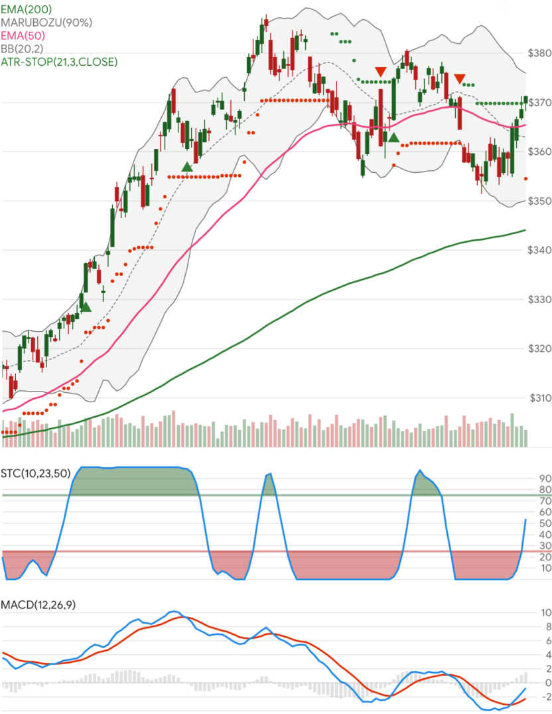

# Stock Indicators

[](https://www.nuget.org/packages/Skender.Stock.Indicators)
[](https://www.nuget.org/packages/Skender.Stock.Indicators)
[](https://dev.azure.com/skender/Stock.Indicators/_build/latest?definitionId=21&branchName=master)
[](https://dev.azure.com/skender/Stock.Indicators/_build/latest?definitionId=21&branchName=master&view=codecoverage-tab)
[](https://github.com/DaveSkender/Stock.Indicators/security/code-scanning)

[Skender.Stock.Indicators](https://www.nuget.org/packages/Skender.Stock.Indicators) is a .NET library that produces [stock indicators](https://daveskender.github.io/Stock.Indicators/docs/INDICATORS.html).  Send in historical price quotes and get back desired technical indicators (such as moving average, relative strength, stochastic oscillator, parabolic SAR, etc).  Nothing more.

It can be used in any market analysis software using standard OHLCV price quotes for equities, commodities, forex, cryptocurrencies, and others.  We had private trading algorithms, machine learning, and charting systems in mind when originally creating this community library.

Explore more information:

- [Indicators and overlays](https://daveskender.github.io/Stock.Indicators/docs/INDICATORS.html)
- [Getting started](#getting-started)
- [Guide and Pro tips](https://daveskender.github.io/Stock.Indicators/docs/GUIDE.html)
- [Contributing guidelines](docs/CONTRIBUTING.md#content)
- [Discussions](https://github.com/DaveSkender/Stock.Indicators/discussions)
- [Release notes](https://github.com/DaveSkender/Stock.Indicators/releases)
- [Demo site](https://stock-charts.azurewebsites.net) (a stock chart)
- [Contact us](#contact-us)

## Samples



See [full list of indicators and overlays](https://daveskender.github.io/Stock.Indicators/docs/INDICATORS.html) for more information.

## Getting started

### Installation and setup

Find and install the [Skender.Stock.Indicators](https://www.nuget.org/packages/Skender.Stock.Indicators) NuGet package into your Project.  See [more help](https://www.google.com/search?q=install+nuget+package) for installing packages.

```powershell
# dotnet CLI example
dotnet add package Skender.Stock.Indicators

# package manager example
Install-Package Skender.Stock.Indicators
```

### Example usage

```csharp
using Skender.Stock.Indicators;

[..]  // prerequisite: get quote history from your own source

// example: get 20-period simple moving average
IEnumerable<SmaResult> results = Indicator.GetSma(history,20);
```

See [individual indicator pages](https://daveskender.github.io/Stock.Indicators/docs/INDICATORS.html) for specific guidance.

## Frameworks targeted

- .NET 5.0
- .NET Core 3.1
- .NET Standard 2.0, 2.1
- .NET Framework 4.6.1

## Contributing

This NuGet package is an open-source project.  If you want to report bugs or contribute fixes, new indicators, or new features, please review our [contributing guidelines](docs/CONTRIBUTING.md#content) and [the backlog](https://github.com/DaveSkender/Stock.Indicators/projects/1).

## Contact us

[Start a new feature discussion, ask a question](https://github.com/DaveSkender/Stock.Indicators/discussions), or [submit an issue](https://github.com/DaveSkender/Stock.Indicators/issues) if it is publicly relevant.  You can also direct message [@daveskender](https://twitter.com/messages/compose?recipient_id=27475431).
