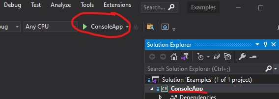

# {{ page.title }}

To help you get started, here are a few minimalist [.NET 7.0](https://dotnet.microsoft.com/en-us/download/dotnet/7.0) C# projects that you can review.  They are complete working examples.

- `ConsoleApp` is a minimalist example of how to use the library (start here)
- `Backtest` is a slightly more complicated example of how to analyze results
- `CustomIndicatorsLibrary` shows how you can [create your own custom indicators]({{site.baseurl}}/custom-indicators/#content)
- `CustomIndicatorsUsage` shows how you'd use a custom indicator just like any other in the main library
- `ObserveStream` [preview] shows how you'd use live quotes from WebSocket, using the Alpaca SDK for .NET
- `UseQuoteApi` shows how you'd get quotes from an API quote source, using the Alpaca SDK for .NET

For more information on how to use this library overall, see the [Guide and Pro Tips]({{site.baseurl}}/guide/#content).

## Getting started with our sample projects

We use an external API quote source for our **streaming** and **quote API** examples.  If you intend to run those locally, you'll need to
[get a free Alpaca API key and secret](https://alpaca.markets/docs/market-data/getting-started/),
then set your local environment variables.

Run the following command line items to set, after replacing the `ALPACA_API_KEY` and `ALPACA_SECRET` values.

```bash
# use your own keys
setx AlpacaApiKey "ALPACA_API_KEY"
setx AlpacaSecret "ALPACA_SECRET"
```

## Get and run the sample projects

1. [Download the ZIP file](Skender.Stock.Indicators-Examples.zip) and extract contents
2. Open `Examples.sln` in [Visual Studio](https://visualstudio.microsoft.com)
3. Review the code in the `Program.cs` file(s)
4. Run the `ConsoleApp` or any other project with one of the following methods:
   - select (will be bold in Solution Explorer) and press the `CTRL+F5` key
   - execute `dotnet run` CLI command in the `ConsoleApp` project folder
   - clicking the play button

     

## Backtest example

``` csharp
/* This is a basic 20-year backtest-style analysis of
 * Stochastic RSI.  It will buy-to-open (BTO) one share
 * when the Stoch RSI (%K) is below 20 and crosses over the
 * Signal (%D). The reverse Sell-to-Close (STC) and
 * Sell-To-Open (STO) occurs when the Stoch RSI is above 80 and
 * crosses below the Signal.
 *
 * As a result, there will always be one open LONG or SHORT
 * position that is opened and closed at signal crossover
 * points in the overbought and oversold regions of the indicator.
 */

// fetch historical quotes from data provider
List<Quote> quotesList = GetQuotesFromFeed()
  .ToList();

// calculate Stochastic RSI
List<StochRsiResult> resultsList =
  quotesList
  .GetStochRsi(14, 14, 3, 1)
  .ToList();

// initialize
decimal trdPrice = 0;
decimal trdQty = 0;
decimal rlzGain = 0;

Console.WriteLine("   Date   Close  StRSI Signal  Cross  Net Gains");
Console.WriteLine("-------------------------------------------------------");

// roll through history
for (int i = 1; i < quotesList.Count; i++)
{
  Quote q = quotesList[i];
  StochRsiResult e = resultsList[i];   // evaluation period
  StochRsiResult l = resultsList[i - 1]; // last (prior) period
  string cross = string.Empty;

  // unrealized gain on open trade
  decimal trdGain = trdQty * (q.Close - trdPrice);

  // check for LONG event
  // condition: Stoch RSI was <= 20 and Stoch RSI crosses over Signal
  if (l.StochRsi <= 20
   && l.StochRsi < l.Signal
   && e.StochRsi >= e.Signal
   && trdQty != 1)
  {
    // emulates BTC + BTO
    rlzGain += trdGain;
    trdQty = 1;
    trdPrice = q.Close;
    cross = "LONG";
  }

  // check for SHORT event
  // condition: Stoch RSI was >= 80 and Stoch RSI crosses under Signal
  if (l.StochRsi >= 80
   && l.StochRsi > l.Signal
   && e.StochRsi <= e.Signal
   && trdQty != -1)
  {
    // emulates STC + STO
    rlzGain += trdGain;
    trdQty = -1;
    trdPrice = q.Close;
    cross = "SHORT";
  }

  if (cross != string.Empty)
  {
    Console.WriteLine(
    $"{q.Date,10:yyyy-MM-dd} " +
    $"{q.Close,10:c2}" +
    $"{e.StochRsi,7:N1}" +
    $"{e.Signal,7:N1}" +
    $"{cross,7}" +
    $"{rlzGain + trdGain,13:c2}");
  }
}
```

### Console output

```console
   Date         Close  StRSI Signal  Cross    Net Gains
-------------------------------------------------------
1999-11-01  $1,354.12   92.0   97.3  SHORT        $0.00
1999-12-01  $1,397.72   14.6    4.9   LONG     ($87.20)
1999-12-28  $1,457.66   96.9   97.6  SHORT       $76.28
2000-01-06  $1,403.45    5.2    2.9   LONG      $124.76
2000-02-09  $1,411.71   63.4   80.3  SHORT       $87.07
2000-02-22  $1,352.17    9.3    6.0   LONG      $197.89
2000-03-06  $1,391.28   77.8   92.6  SHORT      $216.57
2000-04-06  $1,501.34   22.0    7.3   LONG     ($42.66)
2000-05-17  $1,447.80   77.6   92.5  SHORT     ($39.68)
2000-05-24  $1,399.05   33.8   19.8   LONG      $111.36
2000-06-05  $1,467.63   89.9   96.1  SHORT      $199.77
2000-06-26  $1,455.31   29.8    9.9   LONG      $155.83
2000-07-14  $1,509.98  100.0  100.0  SHORT      $252.85
2000-07-25  $1,474.47   18.9   14.3   LONG      $269.20
2000-08-09  $1,472.87   82.5   90.9  SHORT      $230.49
2000-09-07  $1,502.51   29.4   18.2   LONG      $172.81
2000-10-23  $1,395.78   99.0   99.7  SHORT     ($11.01)
2000-11-14  $1,382.95   45.2   15.1   LONG      $121.38
2000-12-12  $1,371.18   89.0   94.1  SHORT       $85.01
2000-12-18  $1,322.74   34.5   34.4   LONG      $193.66
2001-01-05  $1,298.35   58.2   81.8  SHORT       $96.44
2001-02-09  $1,314.76    0.0    0.0   LONG       $88.01
2001-03-09  $1,233.42   46.1   74.1  SHORT     ($58.26)
2001-03-13  $1,197.66   36.0   27.4   LONG       $94.60
2001-03-28  $1,153.29   72.7   79.1  SHORT     ($29.90)
2001-05-15  $1,249.44   12.0   10.9   LONG    ($177.83)
2001-05-18  $1,291.96  100.0  100.0  SHORT        $3.36
2001-05-31  $1,255.82   10.4    3.5   LONG       $33.12
2001-07-05  $1,219.24   57.2   83.8  SHORT     ($76.18)
2001-07-12  $1,208.14   71.5   23.8   LONG     ($17.40)
2001-07-16  $1,202.45   62.9   74.1  SHORT     ($39.88)
2001-07-25  $1,190.49   63.7   42.5   LONG     ($10.27)
2001-08-02  $1,220.75  100.0  100.0  SHORT       $38.29
2001-08-16  $1,181.66   13.5    9.3   LONG       $86.21
2001-08-28  $1,161.51   42.8   75.9  SHORT        $6.82
2001-08-31  $1,133.58   12.8    9.8   LONG       $82.83
[...]
2020-01-08  $3,253.05   22.8   13.4   LONG      $633.19
2020-01-21  $3,320.79   70.1   81.6  SHORT      $797.71
2020-01-28  $3,276.24   24.6    8.2   LONG      $819.07
2020-02-18  $3,370.29   86.4   92.8  SHORT      $962.62
2020-02-26  $3,116.39    0.0    0.0   LONG    $1,376.37
2020-03-27  $2,541.47   87.3   95.8  SHORT     ($27.37)
2020-05-14  $2,852.50   23.5   11.3   LONG     ($74.51)
2020-05-21  $2,948.51   78.6   83.2  SHORT      $428.54
2020-06-15  $3,066.59   19.7   10.6   LONG       $96.37
2020-07-07  $3,145.32   73.8   86.8  SHORT      $371.91
2020-07-27  $3,239.41   32.7   25.2   LONG      $105.00
2020-08-07  $3,351.28  100.0  100.0  SHORT      $422.83
```

## More info

- Tutorial: [Create a simple C# console app](https://docs.microsoft.com/en-us/visualstudio/get-started/csharp/tutorial-console)
- These files can also be found in the [/docs/examples]({{site.github.repository_url}}/tree/main/docs/examples) GitHub repo folder
