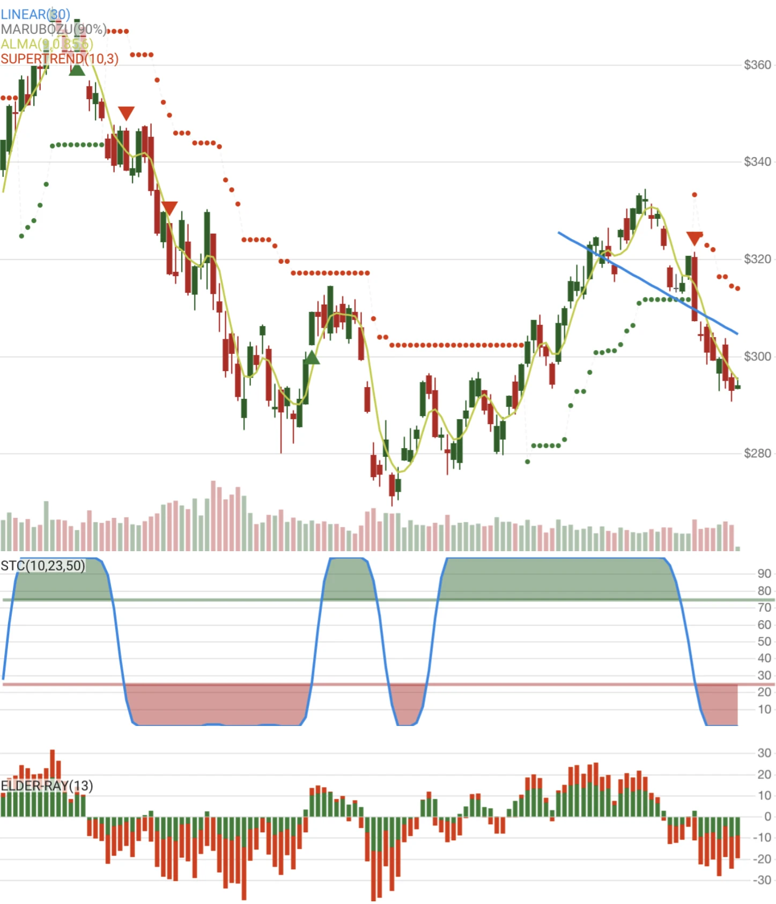

<p style="text-align:center;">
<a href="https://www.nuget.org/packages/Skender.Stock.Indicators" aria-label="Get the NuGet package." class="not-mobile" rel="noopener nofollow" target="_blank"></a>
<a href="https://www.nuget.org/packages/Skender.Stock.Indicators" aria-label="Read more about package downloads." class="not-mobile" rel="noopener nofollow" target="_blank"></a>
</p>

**Stock Indicators for .NET** is a C# [library package](https://www.nuget.org/packages/Skender.Stock.Indicators) that produces financial market technical indicators. Send in historical price quotes and get back desired indicators such as moving averages, Relative Strength Index, Stochastic Oscillator, Parabolic SAR, etc. Nothing more.

Build your technical analysis, trading algorithms, machine learning, charting, or other intelligent market software with this library and your own [OHLCV](/guide/#historical-quotes) price quotes sources for equities, commodities, forex, cryptocurrencies, and others. [Stock Indicators for Python](https://python.stockindicators.dev/) is also available.

Explore more information:

- [Indicators and overlays](/indicators)
- [Guide and Pro tips](/guide)
- [Utilities and helper functions](/utilities)
- [Demo site](https://charts.stockindicators.dev/) (a stock chart)
- [Example usage code](https://github.com/DaveSkender/Stock.Indicators/tree/main/docs/examples)
- [Release notes](https://github.com/DaveSkender/Stock.Indicators/releases)
- [Discussions](https://github.com/DaveSkender/Stock.Indicators/discussions)
- [Contributing guidelines](/contributing)

## Reputable and extensible indicators

You'll get all of the industry standard indicators out-of-the-box. Additionally, you can create compatible [custom indicators](https://github.com/DaveSkender/Stock.Indicators/tree/main/docs/examples/CustomIndicatorsLibrary).



## Easy to use in your application

```csharp
// example: get 20-period simple moving average
IReadOnlyList<SmaResult> results = quotes.GetSma(20);
```

See more [usage examples](/guide/#example-usage).

## Use chaining for unique insights

Optional chaining enables advanced use cases such as building indicators of indicators, measuring the [Slope](/indicators/Slope) for direction, or applying a [moving average](/indicators/#moving-average) to any result.

```csharp
// example: advanced chaining (RSI of OBV)
IEnumerable<RsiResult> results = quotes
    .GetObv()
    .GetRsi(14);

// example: use any candle variant
IEnumerable<EmaResult> results = quotes
    .Use(CandlePart.HL2)
    .GetEma(20);
```

See the [guide](/guide) and the [full indicator library](/indicators) for more chaining examples.

## Optimized for modern .NET frameworks

Our [NuGet library](https://www.nuget.org/packages/Skender.Stock.Indicators) directly targets current frameworks for peak performance:

- .NET 9.0, 8.0, 6.0
- .NET Standard 2.1, 2.0

The compiled package is [CLS compliant](https://learn.microsoft.com/dotnet/standard/common-type-system) so you can use it across the entire .NET ecosystem, including Python integrations.

## Licensed for everyone

[](https://opensource.org/licenses/Apache-2.0)

This repository uses the Apache 2.0 open-source license. Review the [license](https://opensource.org/licenses/Apache-2.0) before using or contributing to the software.

## Share your ideas with the community

**Need help?** Have ideas? [Start a discussion](https://github.com/DaveSkender/Stock.Indicators/discussions), [open an issue](https://github.com/DaveSkender/Stock.Indicators/issues), or send a direct message to [@daveskender](https://twitter.com/messages/compose?recipient_id=27475431).

## Give back with patronage

Thank you for your support! If this library helps you or your organization, add a ⭐ on the [GitHub repository](https://github.com/DaveSkender/Stock.Indicators) as a quick boost of encouragement.

Want to go further? [Become a sponsor](https://github.com/sponsors/facioquo) to help fund ongoing maintenance and new indicator development.

## Contribute to help others

This NuGet package is an open-source project [on GitHub](https://github.com/DaveSkender/Stock.Indicators). To report bugs or contribute fixes, new indicators, or features, review the [contributing guidelines](/contributing) and the [project backlog](https://github.com/users/DaveSkender/projects/1).

Special thanks to our community code contributors:

- [DaveSkender](https://github.com/DaveSkender)
- [copilot-swe-agent](https://github.com/apps/copilot-swe-agent)
- [LeeDongGeon1996](https://github.com/LeeDongGeon1996)
- [dependabot&#91;bot&#93;](https://github.com/apps/dependabot)
- [imgbot&#91;bot&#93;](https://github.com/apps/imgbot)
- [tanjera](https://github.com/tanjera)
- [sshquack](https://github.com/sshquack)
- [chetanku](https://github.com/chetanku)
- [Fredrik-C](https://github.com/Fredrik-C)
- [Temppus](https://github.com/Temppus)
- [Balthius](https://github.com/Balthius)
- [mihakralj](https://github.com/mihakralj)
- [MithrilMan](https://github.com/MithrilMan)
- [RobertWeaver](https://github.com/RobertWeaver)
- [ssathya](https://github.com/ssathya)
- [ooples](https://github.com/ooples)
- [heavymanto](https://github.com/heavymanto)
- [myalgomate](https://github.com/myalgomate)
- [nil1st](https://github.com/nil1st)
- [tiger2014](https://github.com/tiger2014)

» See our [full list of indicators and overlays](/indicators).
