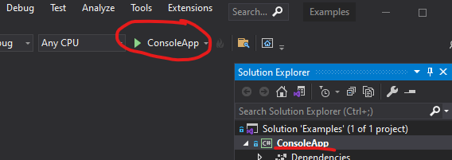

# Example usage code

To help you get started, here are a few minimalist [.NET 9.0](https://dotnet.microsoft.com/en-us/download/dotnet/9.0) C# projects that you can review. They are complete working examples.

- `ConsoleApp` is a minimalist example of how to use the library (start here)
- `Backtest` is a slightly more complicated example of how to analyze results
- `CustomIndicatorsLibrary` shows how you can create your own custom indicators
- `CustomIndicatorsUsage` shows how you'd use custom indicators just like any other in the main library
- `UseQuoteApi` shows how you'd get quotes from an API quote source, using the Alpaca SDK for .NET

For more information on how to use this library overall, see the [Guide and Pro Tips](guide.md).

## Getting started with our sample projects

We use an external API quote source for our **streaming** and **quote API** examples. If you intend to run those locally, you'll need to
[get a free Alpaca API key and secret](https://alpaca.markets/docs/market-data/getting-started/),
then set your local environment variables.

Run the following command line items to set, after replacing the `MY-ALPACA-KEY` and `MY-ALPACA-SECRET` values; then restart your IDE.

```bash
# use your own keys
setx ALPACA_KEY "MY-ALPACA-KEY"
setx ALPACA_SECRET "MY-ALPACA-SECRET"
```

## Get and run the sample projects

1. [Download the ZIP file](Skender.Stock.Indicators-Examples.zip) and extract contents
2. Open `Examples.sln` in [Visual Studio](https://visualstudio.microsoft.com)
3. Review the code in the `Program.cs` file(s)
4. Run the `ConsoleApp` or any other project with one of the following methods:
   - select (will be bold in Solution Explorer) and press the `CTRL+F5` key
   - execute `dotnet run` CLI command in the `ConsoleApp` project folder
   - clicking the play button

     

## Backtest example

```csharp
/* This is a basic 20-year backtest-style analysis of
 * Stochastic RSI.  It will buy-to-open (BTO) one share
 * of stock on K line crossover of 20 and sell-to-close
 * (STC) when %K crosses back below 80.  It will then
 * compute the aggregate return on all trades.
 */

using System;
using System.Collections.Generic;
using System.IO;
using System.Linq;
using Skender.Stock.Indicators;

namespace Backtest
{
    class Program
    {
        static void Main()
        {
            // get historical quotes from a file
            string fileLocation = Directory.GetCurrentDirectory() + "/Data/spx.csv";
            IEnumerable<Quote> quotes = GetQuotesFromFile(fileLocation);

            // backtest strategy
            BacktestStrategy(quotes);

            // end
            Console.WriteLine("\r\n\r\n");
        }

        static void BacktestStrategy(IEnumerable<Quote> quotes)
        {
            // settings and local variables
            decimal budget = 1000000m; // starting cash balance
            decimal totalEquityCost = 0m;
            decimal totalEquityValue = 0m;
            int totalTrades = 0;

            // sequence
            DateTime lastTradeDate = DateTime.MinValue;
            bool activePosition = false;
            decimal buyCost = 0;

            // calculate indicator
            IEnumerable<StochRsiResult> results = quotes
                .GetStochRsi(14, 14, 3, 3)
                .RemoveWarmupPeriods();

            foreach (StochRsiResult r in results)
            {
                // skip this period if another trade was executed today
                if (r.Date <= lastTradeDate)
                {
                    continue;
                }

                Quote q = quotes
                    .Where(x => x.Date == r.Date)
                    .FirstOrDefault();

                // handle null quote ( should not happen )
                if (q == null)
                {
                    continue;
                }

                // buy signal
                if (!activePosition && r.K >= 20 && r.K > r.D)
                {
                    buyCost = q.Close;
                    activePosition = true;
                    lastTradeDate = r.Date;
                    totalTrades++;

                    Console.WriteLine($"BTO: {r.Date:yyyy-MM-dd}, ${q.Close}");
                }

                // sell signal
                else if (activePosition && r.K >= 80 && r.K < r.D)
                {
                    totalEquityCost += buyCost;
                    totalEquityValue += q.Close;

                    buyCost = 0;
                    activePosition = false;
                    lastTradeDate = r.Date;

                    Console.WriteLine($"STC: {r.Date:yyyy-MM-dd}, ${q.Close}");
                }
            }

            // close any open positions
            if (activePosition)
            {
                Quote q = quotes
                    .Where(x => x.Date == results.Last().Date)
                    .FirstOrDefault();

                totalEquityCost += buyCost;
                totalEquityValue += q?.Close ?? 0;

                Console.WriteLine($"STC (forced): {results.Last().Date:yyyy-MM-dd}, ${q?.Close}");
            }

            // recognize unused budget
            decimal netCost = totalEquityCost * 100;
            if (netCost < budget)
            {
                totalEquityValue += (budget - netCost) / 100;
            }

            // report results
            decimal netReturn = (totalEquityValue - totalEquityCost) / totalEquityCost;

            Console.WriteLine($"\r\nSTRATEGY RESULTS:");
            Console.WriteLine($"trades: {totalTrades}");
            Console.WriteLine($"net return: {netReturn:P2}");
        }

        static IEnumerable<Quote> GetQuotesFromFile(string fileLocation)
        {
            List<Quote> quotes = new();

            // load file
            string[] lines = File.ReadAllLines(fileLocation);

            // skip header row and process the rest
            for (int i = 1; i < lines.Length; i++)
            {
                string line = lines[i];
                string[] field = lines[i].Split(',');

                // process field -> quote
                Quote q = new()
                {
                    Date = DateTime.Parse(field[0]),
                    Open = decimal.Parse(field[1]),
                    High = decimal.Parse(field[2]),
                    Low = decimal.Parse(field[3]),
                    Close = decimal.Parse(field[4]),
                    Volume = decimal.Parse(field[5])
                };

                quotes.Add(q);
            }

            // sort and return results
            return quotes
                .OrderBy(x => x.Date);
        }
    }
}
```
