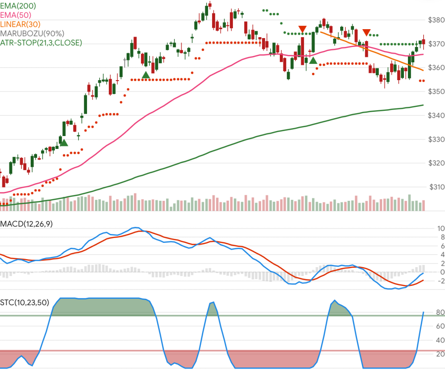

# Stock Indicators for .NET

<div style="text-align:center;">
<a href="https://www.nuget.org/packages/Skender.Stock.Indicators" aria-label="Get the NuGet package."></a>
<a href="https://www.nuget.org/packages/Skender.Stock.Indicators" aria-label="Read more about package downloads."></a>
</div>

**Stock Indicators for .NET** is a C# [library package](https://www.nuget.org/packages/Skender.Stock.Indicators) that produces financial market technical indicators. Send in historical price quotes and get back desired indicators such as moving averages, Relative Strength Index, Stochastic Oscillator, Parabolic SAR, etc. Nothing more.

Build your technical analysis, trading algorithms, machine learning, charting, or other intelligent market software with this library and your own [OHLCV](guide.md#historical-quotes) price quotes sources for equities, commodities, forex, cryptocurrencies, and others. [Stock Indicators for Python](https://python.stockindicators.dev/) is also available.

Explore more information:

- [Indicators and overlays](indicators.md)
- [Guide and Pro tips](guide.md)
- [Utilities and helper functions](utilities.md)
- [Demo site](https://charts.stockindicators.dev/) (a stock chart)
- [Example usage code](examples.md)
- [Release notes](https://github.com/DaveSkender/Stock.Indicators/releases)
- [Discussions](https://github.com/DaveSkender/Stock.Indicators/discussions)
- [Contributing guidelines](contributing.md)

## Reputable and extensible indicators

You'll get all of the industry standard indicators out-of-the-box. Additionally, you can create compatible [custom indicators](guide.md#creating-custom-indicators).



## Easy to use in your application

```csharp
// example: get 20-period simple moving average
IEnumerable<SmaResult> results = quotes.GetSma(20);
```

See more [usage examples](guide.md#example-usage).

## Use chaining for unique insights

Optional chaining enables advanced uses cases; such as, indicator of indicators, [slope](indicators/Slope.md) (direction) of any result, or [moving average](indicators.md#moving-average) of an indicator.
