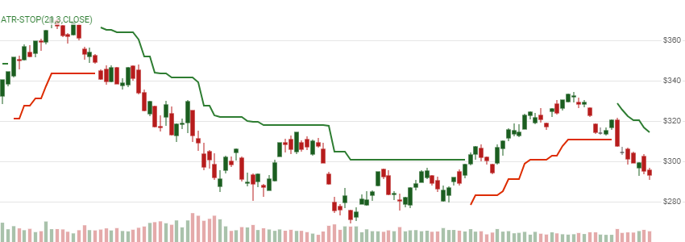

# ATR Trailing Stop

 Created by Welles Wilder, the ATR Trailing Stop indicator attempts to determine the primary trend of financial market prices by using Average True Range (ATR) band thresholds.  It can indicate a buy/sell signal or a trailing stop when the trend changes.


Created by Welles Wilder, the ATR Trailing Stop indicator attempts to determine the primary trend of Close prices by using [Average True Range (ATR)](Atr.md) band thresholds.  It can indicate a buy/sell signal or a trailing stop when the trend changes.
[[Discuss] &#128172;](https://github.com/DaveSkender/Stock.Indicators/discussions/724 "Community discussion about this indicator")



```csharp
// C# usage syntax
IReadOnlyList<AtrStopResult> results =
  quotes.GetAtrStop(lookbackPeriods, multiplier, endType);
```

## Parameters

**`lookbackPeriods`** _`int`_ - Number of periods (`N`) for the ATR evaluation.  Must be greater than 1.  Default is 21.

**`multiplier`** _`double`_ - Multiplier sets the ATR band width.  Must be greater than 0 and is usually set around 2 to 3.  Default is 3.

**`endType`** _`EndType`_ - Determines whether `Close` or `High/Low` is used as basis for stop offset.  See [EndType options](#endtype-options) below.  Default is `EndType.Close`.

### Historical quotes requirements

You must have at least `N+100` periods of `quotes` to cover the [warmup and convergence](https://github.com/DaveSkender/Stock.Indicators/discussions/688) periods.  Since this uses a smoothing technique, we recommend you use at least `N+250` periods prior to the intended usage date for optimal precision.

`quotes` is a collection of generic `TQuote` historical price quotes.  It should have a consistent frequency (day, hour, minute, etc).  See [the Guide](../guide.md#historical-quotes) for more information.

### EndType options

**`EndType.Close`** - Stop offset from `Close` price (default)

**`EndType.HighLow`** - Stop offset from `High` or `Low` price

## Response

```csharp
IReadOnlyList<AtrStopResult>
```

- This method returns a time series of all available indicator values for the `quotes` provided.
- It always returns the same number of elements as there are in the historical quotes.
- It does not return a single incremental indicator value.
- The first `N` periods will have `null` AtrStop values since there's not enough data to calculate.

>&#9886; **Convergence warning**: the line segment before the first reversal and the first `N+100` periods are unreliable due to an initial guess of trend direction and precision convergence for the underlying ATR values.

### AtrStopResult

**`Timestamp`** _`DateTime`_ - date from evaluated `TQuote`

**`AtrStop`** _`double`_ - ATR Trailing Stop line contains both Upper and Lower segments

**`BuyStop`** _`double`_ - Upper band only (green)

**`SellStop`** _`double`_ - Lower band only (red)

**`Atr`** _`double`_ - Average True Range

`BuyStop` and `SellStop` values are provided to differentiate buy vs sell stop lines and to clearly demark trend reversal.  `AtrStop` is the contiguous combination of both upper and lower line data.

### Utilities

- [.Condense()](../utilities.md#sort-quotes)
- [.Find(lookupDate)](../utilities.md#find-indicator-result)
- [.RemoveWarmupPeriods()](../utilities.md#get-or-exclude-nulls)
- [.RemoveWarmupPeriods(qty)](../utilities.md#get-or-exclude-nulls)

See [Utilities and helpers](../utilities.md#utilities-for-indicator-results) for more information.

## Chaining

This indicator is not chain-enabled and must be generated from `quotes`.  It **cannot** be used for further processing by other chain-enabled indicators.
