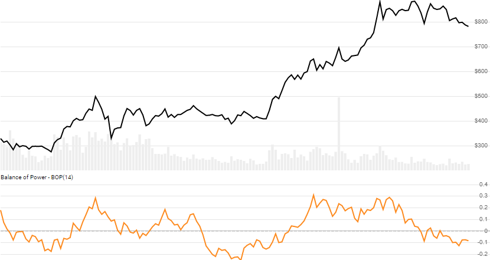

# Balance of Power (BOP)

 Created by Igor Levshin, the [Balance of Power](https://school.stockcharts.com/doku.php?id=technical_indicators:balance_of_power) (aka Balance of Market Power) is a momentum oscillator that depicts the strength of buying and selling pressure.


Created by Igor Levshin, the [Balance of Power](https://school.stockcharts.com/doku.php?id=technical_indicators:balance_of_power) (aka Balance of Market Power) is a momentum oscillator that depicts the strength of buying and selling pressure.
[[Discuss] &#128172;](https://github.com/DaveSkender/Stock.Indicators/discussions/302 "Community discussion about this indicator")



```csharp
// C# usage syntax
IReadOnlyList<BopResult> results =
  quotes.GetBop(smoothPeriods);
```

## Parameters

**`smoothPeriods`** _`int`_ - Number of periods (`N`) for smoothing.  Must be greater than 0.  Default is 14.

### Historical quotes requirements

You must have at least `N` periods of `quotes` to cover the warmup periods.

`quotes` is a collection of generic `TQuote` historical price quotes.  It should have a consistent frequency (day, hour, minute, etc).  See [the Guide](../guide.md#historical-quotes) for more information.

## Response

```csharp
IReadOnlyList<BopResult>
```

- This method returns a time series of all available indicator values for the `quotes` provided.
- It always returns the same number of elements as there are in the historical quotes.
- It does not return a single incremental indicator value.
- The first `N-1` periods will have `null` values since there's not enough data to calculate.

### BopResult

**`Timestamp`** _`DateTime`_ - date from evaluated `TQuote`

**`Bop`** _`double`_ - Balance of Power

### Utilities

- [.Condense()](../utilities.md#sort-quotes)
- [.Find(lookupDate)](../utilities.md#find-indicator-result)
- [.RemoveWarmupPeriods()](../utilities.md#get-or-exclude-nulls)
- [.RemoveWarmupPeriods(qty)](../utilities.md#get-or-exclude-nulls)

See [Utilities and helpers](../utilities.md#utilities-for-indicator-results) for more information.

## Chaining

Results can be further processed on `Bop` with additional chain-enabled indicators.

```csharp
// example
var results = quotes
    .GetBop(..)
    .GetSlope(..);
```

This indicator must be generated from `quotes` and **cannot** be generated from results of another chain-enabled indicator or method.
