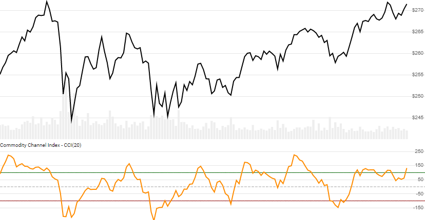

# Commodity Channel Index (CCI)

 Created by Donald Lambert, the Commodity Channel Index is an oscillator depicting deviation from typical price range, often used to identify cyclical trends.


Created by Donald Lambert, the [Commodity Channel Index](https://en.wikipedia.org/wiki/Commodity_channel_index) is an oscillator depicting deviation from typical price range, often used to identify cyclical trends.
[[Discuss] &#128172;](https://github.com/DaveSkender/Stock.Indicators/discussions/265 "Community discussion about this indicator")



```csharp
// C# usage syntax
IReadOnlyList<CciResult> results =
  quotes.GetCci(lookbackPeriods);
```

## Parameters

**`lookbackPeriods`** _`int`_ - Number of periods (`N`) in the moving average.  Must be greater than 0.  Default is 20.

### Historical quotes requirements

You must have at least `N+1` periods of `quotes` to cover the warmup periods.

`quotes` is a collection of generic `TQuote` historical price quotes.  It should have a consistent frequency (day, hour, minute, etc).  See [the Guide](../guide.md#historical-quotes) for more information.

## Response

```csharp
IReadOnlyList<CciResult>
```

- This method returns a time series of all available indicator values for the `quotes` provided.
- It always returns the same number of elements as there are in the historical quotes.
- It does not return a single incremental indicator value.
- The first `N-1` periods will have `null` values since there's not enough data to calculate.

### CciResult

**`Timestamp`** _`DateTime`_ - date from evaluated `TQuote`

**`Cci`** _`double`_ - Commodity Channel Index

### Utilities

- [.Condense()](../utilities.md#sort-quotes)
- [.Find(lookupDate)](../utilities.md#find-indicator-result)
- [.RemoveWarmupPeriods()](../utilities.md#get-or-exclude-nulls)
- [.RemoveWarmupPeriods(qty)](../utilities.md#get-or-exclude-nulls)

See [Utilities and helpers](../utilities.md#utilities-for-indicator-results) for more information.

## Chaining

Results can be further processed on `Cci` with additional chain-enabled indicators.

```csharp
// example
var results = quotes
    .GetCci(..)
    .GetSlope(..);
```

This indicator must be generated from `quotes` and **cannot** be generated from results of another chain-enabled indicator or method.
