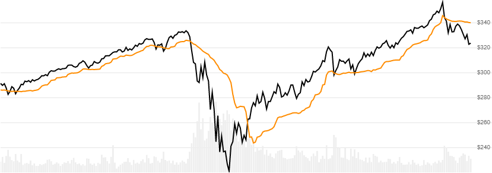

# Chandelier Exit

 Created by Charles Le Beau, the Chandelier Exit is an adjusted Average True Range (ATR) offset from price that is typically used for stop-loss and can be computed for both long or short types.


Created by Charles Le Beau, the [Chandelier Exit](https://school.stockcharts.com/doku.php?id=technical_indicators:chandelier_exit) is an adjusted Average True Range (ATR) offset from price that is is typically used for stop-loss and can be computed for both long or short types.
[[Discuss] &#128172;](https://github.com/DaveSkender/Stock.Indicators/discussions/263 "Community discussion about this indicator")



```csharp
// C# usage syntax
IReadOnlyList<ChandelierResult> results =
  quotes.GetChandelier(lookbackPeriods, multiplier, type);
```

## Parameters

**`lookbackPeriods`** _`int`_ - Number of periods (`N`) for the lookback evaluation.  Default is 22.

**`multiplier`** _`double`_ - Multiplier number must be a positive value.  Default is 3.

**`type`** _`ChandelierType`_ - Direction of exit.  See [ChandelierType options](#chandeliertype-options) below.  Default is `ChandelierType.Long`.

### Historical quotes requirements

You must have at least `N+1` periods of `quotes` to cover the warmup periods.

`quotes` is a collection of generic `TQuote` historical price quotes.  It should have a consistent frequency (day, hour, minute, etc).  See [the Guide](../guide.md#historical-quotes) for more information.

### ChandelierType options

**`ChandelierType.Long`** - Intended as stop loss value for long positions. (default)

**`ChandelierType.Short`** - Intended as stop loss value for short positions.

## Response

```csharp
IReadOnlyList<ChandelierResult>
```

- This method returns a time series of all available indicator values for the `quotes` provided.
- It always returns the same number of elements as there are in the historical quotes.
- It does not return a single incremental indicator value.
- The first `N` periods will have `null` Chandelier values since there's not enough data to calculate.

### ChandelierResult

**`Timestamp`** _`DateTime`_ - date from evaluated `TQuote`

**`ChandelierExit`** _`double`_ - Exit line

### Utilities

- [.Condense()](../utilities.md#sort-quotes)
- [.Find(lookupDate)](../utilities.md#find-indicator-result)
- [.RemoveWarmupPeriods()](../utilities.md#get-or-exclude-nulls)
- [.RemoveWarmupPeriods(qty)](../utilities.md#get-or-exclude-nulls)

See [Utilities and helpers](../utilities.md#utilities-for-indicator-results) for more information.

## Chaining

Results can be further processed on `ChandelierExit` with additional chain-enabled indicators.

```csharp
// example
var results = quotes
    .GetChandelier(..)
    .GetEma(..);
```

This indicator must be generated from `quotes` and **cannot** be generated from results of another chain-enabled indicator or method.
