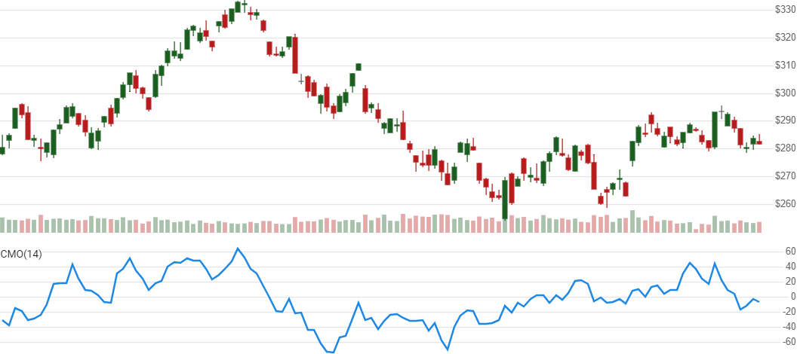

# Chande Momentum Oscillator (CMO)

 The Chande Momentum Oscillator is a momentum indicator depicting the weighted percent of higher prices in financial markets.


Created by Tushar Chande, the [Chande Momentum Oscillator](https://www.investopedia.com/terms/c/chandemomentumoscillator.asp) is a weighted percent of higher prices over a lookback window.
[[Discuss] &#128172;](https://github.com/DaveSkender/Stock.Indicators/discussions/892 "Community discussion about this indicator")



```csharp
// C# usage syntax
IReadOnlyList<CmoResult> results =
  quotes.GetCmo(lookbackPeriods);
```

## Parameters

**`lookbackPeriods`** _`int`_ - Number of periods (`N`) in the lookback window.  Must be greater than 0.

### Historical quotes requirements

You must have at least `N+1` periods of `quotes` to cover the warmup periods.

`quotes` is a collection of generic `TQuote` historical price quotes.  It should have a consistent frequency (day, hour, minute, etc).  See [the Guide](../guide.md#historical-quotes) for more information.

## Response

```csharp
IReadOnlyList<CmoResult>
```

- This method returns a time series of all available indicator values for the `quotes` provided.
- It always returns the same number of elements as there are in the historical quotes.
- It does not return a single incremental indicator value.
- The first `N` periods will have `null` values for CMO since there's not enough data to calculate.

### CmoResult

**`Timestamp`** _`DateTime`_ - date from evaluated `TQuote`

**`Cmo`** _`double`_ - Chande Momentum Oscillator

### Utilities

- [.Condense()](../utilities.md#sort-quotes)
- [.Find(lookupDate)](../utilities.md#find-indicator-result)
- [.RemoveWarmupPeriods()](../utilities.md#get-or-exclude-nulls)
- [.RemoveWarmupPeriods(qty)](../utilities.md#get-or-exclude-nulls)

See [Utilities and helpers](../utilities.md#utilities-for-indicator-results) for more information.

## Chaining

This indicator may be generated from any chain-enabled indicator or method.

```csharp
// example
var results = quotes
    .Use(CandlePart.HL2)
    .GetCmo(..);
```

Results can be further processed on `Cmo` with additional chain-enabled indicators.

```csharp
// example
var results = quotes
    .GetCmo(..)
    .GetEma(..);
```
