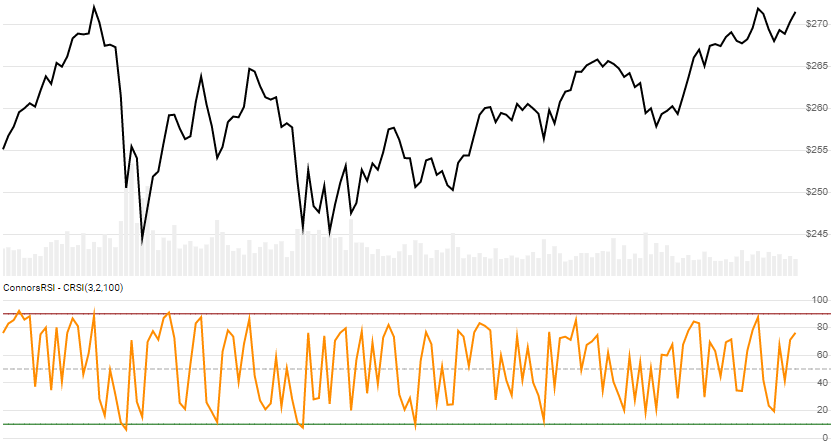

# ConnorsRSI

 Created by Laurence Connors, the ConnorsRSI is a composite oscillator that incorporates RSI, winning/losing streaks, and percentile gain metrics on scale of 0 to 100.


Created by Laurence Connors, the [ConnorsRSI](https://alvarezquanttrading.com/wp-content/uploads/2016/05/ConnorsRSIGuidebook.pdf) is a composite oscillator that incorporates RSI, winning/losing streaks, and percentile gain metrics on scale of 0 to 100.  See [analysis](https://alvarezquanttrading.com/blog/connorsrsi-analysis).
[[Discuss] &#128172;](https://github.com/DaveSkender/Stock.Indicators/discussions/260 "Community discussion about this indicator")



```csharp
// C# usage syntax
IReadOnlyList<ConnorsRsiResult> results =
  quotes.GetConnorsRsi(rsiPeriods, streakPeriods, rankPeriods);
```

## Parameters

**`rsiPeriods`** _`int`_ - Lookback period (`R`) for the price RSI.  Must be greater than 1.  Default is 3.

**`streakPeriods`** _`int`_ - Lookback period (`S`) for the streak RSI.  Must be greater than 1.  Default is 2.

**`rankPeriods`** _`int`_ - Lookback period (`P`) for the Percentile Rank.  Must be greater than 1.  Default is 100.

### Historical quotes requirements

`N` is the greater of `R+100`, `S`, and `P+2`.  You must have at least `N` periods of `quotes` to cover the [warmup and convergence](https://github.com/DaveSkender/Stock.Indicators/discussions/688) periods.  Since this uses a smoothing technique, we recommend you use at least `N+150` data points prior to the intended usage date for better precision.

`quotes` is a collection of generic `TQuote` historical price quotes.  It should have a consistent frequency (day, hour, minute, etc).  See [the Guide](../guide.md#historical-quotes) for more information.

## Response

```csharp
IReadOnlyList<ConnorsRsiResult>
```

- This method returns a time series of all available indicator values for the `quotes` provided.
- It always returns the same number of elements as there are in the historical quotes.
- It does not return a single incremental indicator value.
- The first `MAX(R,S,P)-1` periods will have `null` values since there's not enough data to calculate.

>&#9886; **Convergence warning**: The first `N` periods will have decreasing magnitude, convergence-related precision errors that can be as high as ~5% deviation in indicator values for earlier periods.

### ConnorsRsiResult

**`Timestamp`** _`DateTime`_ - date from evaluated `TQuote`

**`Rsi`** _`double`_ - `RSI(R)` of the price.

**`RsiStreak`** _`double`_ - `RSI(S)` of the Streak.

**`PercentRank`** _`double`_ - Percentile rank of the period gain value.

**`ConnorsRsi`** _`double`_ - ConnorsRSI

### Utilities

- [.Condense()](../utilities.md#sort-quotes)
- [.Find(lookupDate)](../utilities.md#find-indicator-result)
- [.RemoveWarmupPeriods()](../utilities.md#get-or-exclude-nulls)
- [.RemoveWarmupPeriods(qty)](../utilities.md#get-or-exclude-nulls)

See [Utilities and helpers](../utilities.md#utilities-for-indicator-results) for more information.

## Chaining

This indicator may be generated from any chain-enabled indicator or method.

```csharp
// example
var results = quotes
    .Use(CandlePart.HL2)
    .GetConnorsRsi(..);
```

Results can be further processed on `ConnorsRsi` with additional chain-enabled indicators.

```csharp
// example
var results = quotes
    .GetConnorsRsi(..)
    .GetSma(..);
```
