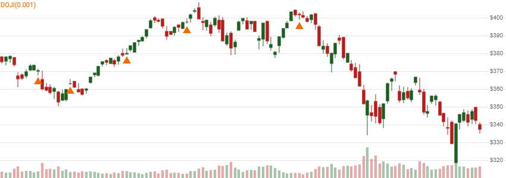

# Doji

 Doji is a single-bar candlestick pattern where open and close price are virtually identical, representing market indecision.


[Doji](https://en.wikipedia.org/wiki/Doji) is a single-bar candlestick pattern where open and close price are virtually identical, representing market indecision.
[[Discuss] &#128172;](https://github.com/DaveSkender/Stock.Indicators/discussions/734 "Community discussion about this indicator")



```csharp
// C# usage syntax
IReadOnlyList<CandleResult> results =
  quotes.GetDoji(maxPriceChangePercent);
```

## Parameters

**`maxPriceChangePercent`** _`double`_ - Optional.  Maximum absolute percent difference in open and close price.  Example: 0.3% would be entered as 0.3 (not 0.003).  Must be between 0 and 0.5 percent, if specified.  Default is 0.1 (0.1%).

### Historical quotes requirements

You must have at least one historical quote; however, more is typically provided since this is a chartable candlestick pattern.

`quotes` is a collection of generic `TQuote` historical price quotes.  It should have a consistent frequency (day, hour, minute, etc).  See [the Guide](../guide.md#historical-quotes) for more information.

## Response

```csharp
IReadOnlyList<CandleResult>
```

- This method returns a time series of all available indicator values for the `quotes` provided.
- It always returns the same number of elements as there are in the historical quotes.
- It does not return a single incremental indicator value.
- The candlestick pattern is indicated on dates where `Match` is `Match.Neutral`.
- `Price` is `Close` price; however, all OHLCV elements are included in `CandleProperties`.
- There is no intrinsic basis or confirmation signal provided for this pattern.



### Utilities

- [.Condense()](../utilities.md#sort-quotes)
- [.Find(lookupDate)](../utilities.md#find-indicator-result)
- [.RemoveWarmupPeriods(qty)](../utilities.md#get-or-exclude-nulls)

See [Utilities and helpers](../utilities.md#utilities-for-indicator-results) for more information.
