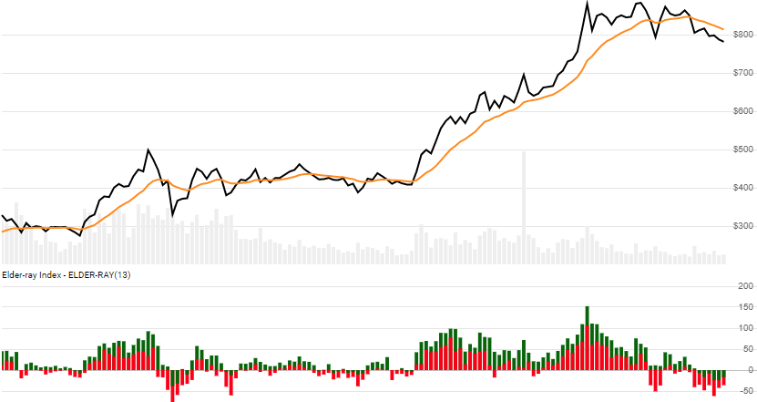

# Elder-ray Index

 Created by Alexander Elder, the Elder-ray Index, also known as Bull and Bear Power, is an oscillator that depicts buying and selling pressure.  It compares current high/low prices against an Exponential Moving Average.


Created by Alexander Elder, the [Elder-ray Index](https://www.investopedia.com/terms/e/elderray.asp), also known as Bull and Bear Power, is an oscillator that depicts buying and selling pressure.  It compares current high/low prices against an Exponential Moving Average.
[[Discuss] &#128172;](https://github.com/DaveSkender/Stock.Indicators/discussions/378 "Community discussion about this indicator")



```csharp
// C# usage syntax
IReadOnlyList<ElderRayResult> results =
  quotes.GetElderRay(lookbackPeriods);
```

## Parameters

**`lookbackPeriods`** _`int`_ - Number of periods (`N`) for the underlying EMA evaluation.  Must be greater than 0.  Default is 13.

### Historical quotes requirements

You must have at least `2×N` or `N+100` periods of `quotes`, whichever is more, to cover the [warmup and convergence](https://github.com/DaveSkender/Stock.Indicators/discussions/688) periods.  Since this uses a smoothing technique, we recommend you use at least `N+250` data points prior to the intended usage date for better precision.

`quotes` is a collection of generic `TQuote` historical price quotes.  It should have a consistent frequency (day, hour, minute, etc).  See [the Guide](../guide.md#historical-quotes) for more information.

## Response

```csharp
IReadOnlyList<ElderRayResult>
```

- This method returns a time series of all available indicator values for the `quotes` provided.
- It always returns the same number of elements as there are in the historical quotes.
- It does not return a single incremental indicator value.
- The first `N-1` periods will have `null` indicator values since there's not enough data to calculate.

>&#9886; **Convergence warning**: The first `N+100` periods will have decreasing magnitude, convergence-related precision errors that can be as high as ~5% deviation in indicator values for earlier periods.

### ElderRayResult

**`Timestamp`** _`DateTime`_ - date from evaluated `TQuote`

**`Ema`** _`double`_ - Exponential moving average

**`BullPower`** _`double`_ - Bull Power

**`BearPower`** _`double`_ - Bear Power

### Utilities

- [.Condense()](../utilities.md#sort-quotes)
- [.Find(lookupDate)](../utilities.md#find-indicator-result)
- [.RemoveWarmupPeriods()](../utilities.md#get-or-exclude-nulls)
- [.RemoveWarmupPeriods(qty)](../utilities.md#get-or-exclude-nulls)

See [Utilities and helpers](../utilities.md#utilities-for-indicator-results) for more information.

## Chaining

Results can be further processed on `(BullPower+BearPower)` with additional chain-enabled indicators.

```csharp
// example
var results = quotes
    .GetElderRay(..)
    .GetEma(..);
```

This indicator must be generated from `quotes` and **cannot** be generated from results of another chain-enabled indicator or method.
