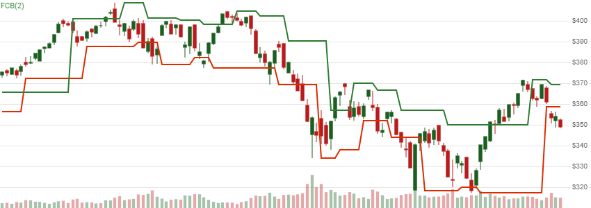

# Fractal Chaos Bands (FCB)

 Created by Edward William Dreiss, Fractal Chaos Bands outline high and low price channels to depict broad less-chaotic price movements.  FCB is a channelized depiction of Williams Fractal.


Created by Edward William Dreiss, Fractal Chaos Bands outline high and low price channels to depict broad less-chaotic price movements.  FCB is a channelized depiction of <a href="Fractal.md" rel="nofollow">Williams Fractal</a>.
[[Discuss] &#128172;](https://github.com/DaveSkender/Stock.Indicators/discussions/347 "Community discussion about this indicator")



```csharp
// C# usage syntax
IReadOnlyList<FcbResult> results =
  quotes.GetFcb(windowSpan);
```

## Parameters

**`windowSpan`** _`int`_ - Fractal evaluation window span width (`S`).  Must be at least 2.  Default is 2.

The total evaluation window size is `2×S+1`, representing `±S` from the evaluation date.  See [Williams Fractal](Fractal.md) for more information about Fractals and `windowSpan`.

### Historical quotes requirements

You must have at least `2×S+1` periods of `quotes` to cover the warmup periods; however, more is typically provided since this is a chartable candlestick pattern.

`quotes` is a collection of generic `TQuote` historical price quotes.  It should have a consistent frequency (day, hour, minute, etc).  See [the Guide](../guide.md#historical-quotes) for more information.

## Response

```csharp
IReadOnlyList<FcbResult>
```

- This method returns a time series of all available indicator values for the `quotes` provided.
- It always returns the same number of elements as there are in the historical quotes.
- It does not return a single incremental indicator value.
- The periods before the first fractal are `null` since they cannot be calculated.

### FcbResult

**`Timestamp`** _`DateTime`_ - date from evaluated `TQuote`

**`UpperBand`** _`decimal`_ - FCB upper band

**`LowerBand`** _`decimal`_ - FCB lower band

### Utilities

- [.Condense()](../utilities.md#sort-quotes)
- [.Find(lookupDate)](../utilities.md#find-indicator-result)
- [.RemoveWarmupPeriods()](../utilities.md#get-or-exclude-nulls)
- [.RemoveWarmupPeriods(qty)](../utilities.md#get-or-exclude-nulls)

See [Utilities and helpers](../utilities.md#utilities-for-indicator-results) for more information.

## Chaining

This indicator is not chain-enabled and must be generated from `quotes`.  It **cannot** be used for further processing by other chain-enabled indicators.
