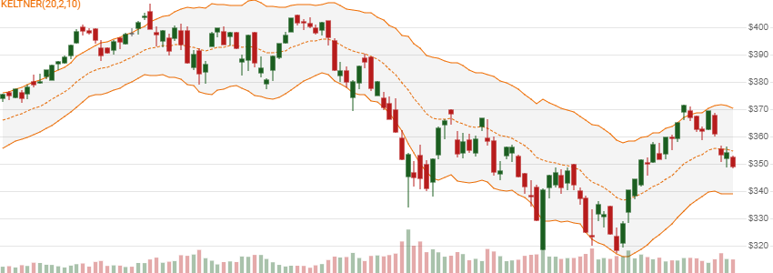

# Keltner Channels

 Created by Chester W. Keltner, the Keltner Channels price range overlay is based on an EMA centerline and Average True Range (ATR) band widths.  STARC Bands are the SMA centerline equivalent.


Created by Chester W. Keltner, [Keltner Channels](https://en.wikipedia.org/wiki/Keltner_channel) are based on an EMA centerline and ATR band widths.  See also <a href="StarcBands.md" rel="nofollow">STARC Bands</a> for an SMA centerline equivalent.
[[Discuss] &#128172;](https://github.com/DaveSkender/Stock.Indicators/discussions/249 "Community discussion about this indicator")



```csharp
// C# usage syntax
IReadOnlyList<KeltnerResult> results =
  quotes.GetKeltner(emaPeriods, multiplier, atrPeriods);
```

## Parameters

**`emaPeriods`** _`int`_ - Number of lookback periods (`E`) for the center line moving average.  Must be greater than 1 to calculate.  Default is 20.

**`multiplier`** _`double`_ - ATR Multiplier. Must be greater than 0.  Default is 2.

**`atrPeriods`** _`int`_ - Number of lookback periods (`A`) for the Average True Range.  Must be greater than 1 to calculate.  Default is 10.

### Historical quotes requirements

You must have at least `2×N` or `N+100` periods of `quotes`, whichever is more, where `N` is the greater of `E` or `A` periods, to cover the [warmup and convergence](https://github.com/DaveSkender/Stock.Indicators/discussions/688) periods.  Since this uses a smoothing technique, we recommend you use at least `N+250` data points prior to the intended usage date for better precision.

`quotes` is a collection of generic `TQuote` historical price quotes.  It should have a consistent frequency (day, hour, minute, etc).  See [the Guide](../guide.md#historical-quotes) for more information.

## Response

```csharp
IReadOnlyList<KeltnerResult>
```

- This method returns a time series of all available indicator values for the `quotes` provided.
- It always returns the same number of elements as there are in the historical quotes.
- It does not return a single incremental indicator value.
- The first `N-1` periods will have `null` values since there's not enough data to calculate.

>&#9886; **Convergence warning**: The first `N+250` periods will have decreasing magnitude, convergence-related precision errors that can be as high as ~5% deviation in indicator values for earlier periods.

### KeltnerResult

**`Timestamp`** _`DateTime`_ - date from evaluated `TQuote`

**`UpperBand`** _`double`_ - Upper band of Keltner Channel

**`Centerline`** _`double`_ - EMA of price

**`LowerBand`** _`double`_ - Lower band of Keltner Channel

**`Width`** _`double`_ - Width as percent of Centerline price.  `(UpperBand-LowerBand)/Centerline`

### Utilities

- [.Condense()](../utilities.md#sort-quotes)
- [.Find(lookupDate)](../utilities.md#find-indicator-result)
- [.RemoveWarmupPeriods()](../utilities.md#get-or-exclude-nulls)
- [.RemoveWarmupPeriods(qty)](../utilities.md#get-or-exclude-nulls)

See [Utilities and helpers](../utilities.md#utilities-for-indicator-results) for more information.

## Chaining

This indicator is not chain-enabled and must be generated from `quotes`.  It **cannot** be used for further processing by other chain-enabled indicators.
