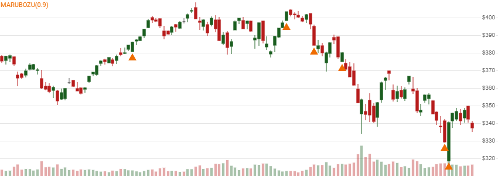

# Marubozu

 Marubozu is a single-bar candlestick pattern that has no wicks, representing consistent directional movement.


[Marubozu](https://en.wikipedia.org/wiki/Marubozu) is a single-bar candlestick pattern that has no wicks, representing consistent directional movement.
[[Discuss] &#128172;](https://github.com/DaveSkender/Stock.Indicators/discussions/512 "Community discussion about this indicator")



```csharp
// C# usage syntax
IReadOnlyList<CandleResult> results =
  quotes.GetMarubozu(minBodyPercent);
```

## Parameters

**`minBodyPercent`** _`double`_ - Optional.  Minimum body size as a percent of total candle size.  Example: 85% would be entered as 85 (not 0.85).  Must be between 80 and 100, if specified.  Default is 95 (95%).

### Historical quotes requirements

You must have at least one historical quote; however, more is typically provided since this is a chartable candlestick pattern.

`quotes` is a collection of generic `TQuote` historical price quotes.  It should have a consistent frequency (day, hour, minute, etc).  See [the Guide](../guide.md#historical-quotes) for more information.

## Response

```csharp
IReadOnlyList<CandleResult>
```

- This method returns a time series of all available indicator values for the `quotes` provided.
- It always returns the same number of elements as there are in the historical quotes.
- It does not return a single incremental indicator value.
- The candlestick pattern is indicated on dates where `Match` is `Match.BullSignal` or `Match.BearSignal`.
- `Price` is `Close` price; however, all OHLCV elements are included in `CandleProperties`.
- There is no intrinsic basis or confirmation signal provided for this pattern.



### Utilities

- [.Condense()](../utilities.md#sort-quotes)
- [.Find(lookupDate)](../utilities.md#find-indicator-result)
- [.RemoveWarmupPeriods(qty)](../utilities.md#get-or-exclude-nulls)

See [Utilities and helpers](../utilities.md#utilities-for-indicator-results) for more information.
