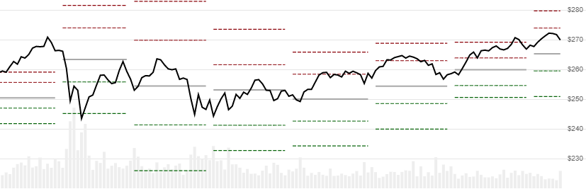

# Pivot Points

 Pivot Points depict classic support and resistance levels, based on prior calendar windows.  You can specify window size (e.g. month, week, day, etc) and any of the traditional Floor Trading, Camarilla, Demark, Fibonacci, and Woodie variants.


[Pivot Points](https://en.wikipedia.org/wiki/Pivot_point_(technical_analysis)) depict support and resistance levels, based on prior calendar windows.  You can specify window size (e.g. month, week, day, etc) and any of the traditional Floor Trading, Camarilla, Demark, Fibonacci, and Woodie variants.

[[Discuss] &#128172;](https://github.com/DaveSkender/Stock.Indicators/discussions/274 "Community discussion about this indicator")



```csharp
// C# usage syntax
IReadOnlyList<PivotPointsResult> results =
  quotes.GetPivotPoints(windowSize, pointType);
```

## Parameters

**`windowSize`** _`PeriodSize`_ - Size of the lookback window

**`pointType`** _`PivotPointType`_ - Type of Pivot Point.  Default is `PivotPointType.Standard`

### Historical quotes requirements

You must have at least `2` windows of `quotes` to cover the warmup periods.  For example, if you specify a `Week` window size, you need at least 14 calendar days of `quotes`.

`quotes` is a collection of generic `TQuote` historical price quotes.  It should have a consistent frequency (day, hour, minute, etc).  See [the Guide](../guide.md#historical-quotes) for more information.

### PeriodSize options (for windowSize)

**`PeriodSize.Month`** - Use the prior month's data to calculate current month's Pivot Points

**`PeriodSize.Week`** - [..] weekly

**`PeriodSize.Day`** - [..] daily.  Commonly used for intraday data.

**`PeriodSize.OneHour`** - [..] hourly

### PivotPointType options

**`PivotPointType.Standard`** - Floor Trading (default)

**`PivotPointType.Camarilla`** - Camarilla

**`PivotPointType.Demark`** - Demark

**`PivotPointType.Fibonacci`** - Fibonacci

**`PivotPointType.Woodie`** - Woodie

## Response

```csharp
IReadOnlyList<PivotPointsResult>
```

- This method returns a time series of all available indicator values for the `quotes` provided.
- It always returns the same number of elements as there are in the historical quotes.
- It does not return a single incremental indicator value.
- The first window will have `null` values since there's not enough data to calculate.

> &#128681; **Warning**: The second window may be inaccurate if the first window contains incomplete data.  For example, this can occur if you specify a `Month` window size and only provide 45 calendar days (1.5 months) of `quotes`.
>
> &#128073; **Repaint warning**: the last window will be repainted if it does not contain a full window of data.

### PivotPointsResult

**`Timestamp`** _`DateTime`_ - date from evaluated `TQuote`

**`R3`** _`decimal`_ - Resistance level 3

**`R2`** _`decimal`_ - Resistance level 2

**`R1`** _`decimal`_ - Resistance level 1

**`PP`** _`decimal`_ - Pivot Point

**`S1`** _`decimal`_ - Support level 1

**`S2`** _`decimal`_ - Support level 2

**`S3`** _`decimal`_ - Support level 3

### Utilities

- [.Find(lookupDate)](../utilities.md#find-indicator-result)
- [.RemoveWarmupPeriods()](../utilities.md#get-or-exclude-nulls)
- [.RemoveWarmupPeriods(qty)](../utilities.md#get-or-exclude-nulls)

See [Utilities and helpers](../utilities.md#utilities-for-indicator-results) for more information.

## Chaining

This indicator is not chain-enabled and must be generated from `quotes`.  It **cannot** be used for further processing by other chain-enabled indicators.
