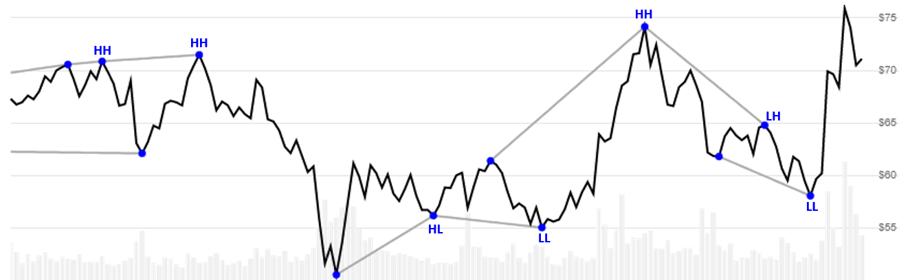

# Pivots

 Pivots is an extended customizable version of Williams Fractal that includes identification of Higher High, Lower Low, Higher Low, and Lower Low trends between pivots in a lookback window.


Pivots is an extended customizable version of <a href="Fractal.md" rel="nofollow">Williams Fractal</a> that includes identification of Higher High, Lower Low, Higher Low, and Lower Low trends between pivots in a lookback window.
[[Discuss] &#128172;](https://github.com/DaveSkender/Stock.Indicators/discussions/436 "Community discussion about this indicator")



```csharp
// C# usage syntax
IReadOnlyList<PivotsResult> results =
  quotes.GetPivots(leftSpan, rightSpan, maxTrendPeriods, endType);
```

## Parameters

**`leftSpan`** _`int`_ - Left evaluation window span width (`L`).  Must be at least 2.  Default is 2.

**`rightSpan`** _`int`_ - Right evaluation window span width (`R`).  Must be at least 2.  Default is 2.

**`maxTrendPeriods`** _`int`_ - Number of periods (`N`) in evaluation window.  Must be greater than `leftSpan`.  Default is 20.

**`endType`** _`EndType`_ - Determines whether `Close` or `High/Low` are used to find end points.  See [EndType options](#endtype-options) below.  Default is `EndType.HighLow`.

The total evaluation window size is `L+R+1`.

### Historical quotes requirements

You must have at least `L+R+1` periods of `quotes` to cover the warmup periods; however, more is typically provided since this is a chartable candlestick pattern.

`quotes` is a collection of generic `TQuote` historical price quotes.  It should have a consistent frequency (day, hour, minute, etc).  See [the Guide](../guide.md#historical-quotes) for more information.

### EndType options

**`EndType.Close`** - Chevron point identified from `Close` price

**`EndType.HighLow`** - Chevron point identified from `High` and `Low` price (default)

## Response

```csharp
IReadOnlyList<PivotsResult>
```

- This method returns a time series of all available indicator values for the `quotes` provided.
- It always returns the same number of elements as there are in the historical quotes.
- It does not return a single incremental indicator value.
- The first `L` and last `R` periods in `quotes` are unable to be calculated since there's not enough prior/following data.

> &#128073; **Repaint warning**: this price pattern looks forward and backward in the historical quotes so it will never identify a pivot in the last `R` periods of `quotes`.  Fractals are retroactively identified.

### PivotsResult

**`Timestamp`** _`DateTime`_ - date from evaluated `TQuote`

**`HighPoint`** _`decimal`_ - Value indicates a **high** point; otherwise `null` is returned.

**`LowPoint`** _`decimal`_ - Value indicates a **low** point; otherwise `null` is returned.

**`HighLine`** _`decimal`_ - Drawn line between two high points in the `maxTrendPeriods`

**`LowLine`** _`decimal`_ - Drawn line between two low points in the `maxTrendPeriods`

**`HighTrend`** _`PivotTrend`_ - Enum that represents higher high or lower high.  See [PivotTrend values](#pivottrend-values) below.

**`LowTrend`** _`PivotTrend`_ - Enum that represents higher low or lower low.  See [PivotTrend values](#pivottrend-values) below.

#### PivotTrend values

**`PivotTrend.HH`** - Higher high

**`PivotTrend.LH`** - Lower high

**`PivotTrend.HL`** - Higher low

**`PivotTrend.LL`** - Lower low

### Utilities

- [.Condense()](../utilities.md#sort-quotes)
- [.Find(lookupDate)](../utilities.md#find-indicator-result)
- [.RemoveWarmupPeriods(qty)](../utilities.md#get-or-exclude-nulls)

See [Utilities and helpers](../utilities.md#utilities-for-indicator-results) for more information.

## Chaining

This indicator is not chain-enabled and must be generated from `quotes`.  It **cannot** be used for further processing by other chain-enabled indicators.
