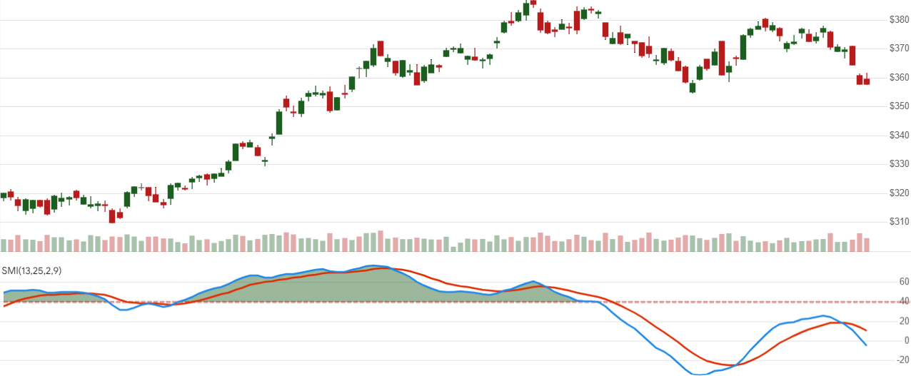

# Stochastic Momentum Index (SMI)

 Created by William Blau, the Stochastic Momentum Index (SMI) oscillator is a double-smoothed variant of the traditional Stochastic Oscillator, depicted on a scale from -100 to 100.


Created by William Blau, the Stochastic Momentum Index (SMI) oscillator is a double-smoothed variant of the [Stochastic Oscillator](Stoch.md), depicted on a scale from -100 to 100.
[[Discuss] &#128172;](https://github.com/DaveSkender/Stock.Indicators/discussions/625 "Community discussion about this indicator")



```csharp
// C# usage syntax (standard)
IReadOnlyList<SmiResult> results =
  quotes.GetSmi(lookbackPeriods, firstSmoothPeriods,
                 secondSmoothPeriods, signalPeriods);
```

## Parameters

**`lookbackPeriods`** _`int`_ - Lookback period (`N`) for the stochastic.  Must be greater than 0.  Default is 13.

**`firstSmoothPeriods`** _`int`_ - First smoothing factor lookback.  Must be greater than 0.  Default is 25.

**`secondSmoothPeriods`** _`int`_ - Second smoothing factor lookback.  Must be greater than 0.  Default is 2.

**`signalPeriods`** _`int`_ - EMA of SMI lookback periods.  Must be greater than 0. Default is 3.

### Historical quotes requirements

You must have at least `N+100` periods of `quotes` to cover the [warmup and convergence](https://github.com/DaveSkender/Stock.Indicators/discussions/688) periods.

`quotes` is a collection of generic `TQuote` historical price quotes.  It should have a consistent frequency (day, hour, minute, etc).  See [the Guide](../guide.md#historical-quotes) for more information.

## Response

```csharp
IReadOnlyList<SmiResult>
```

- This method returns a time series of all available indicator values for the `quotes` provided.
- It always returns the same number of elements as there are in the historical quotes.
- It does not return a single incremental indicator value.
- The first `N-1` periods will have `null` SMI values since there's not enough data to calculate.

>&#9886; **Convergence warning**: The first `N+100` periods will have decreasing magnitude, convergence-related precision errors that can be as high as ~5% deviation in indicator values for earlier periods.

### SmiResult

**`Timestamp`** _`DateTime`_ - date from evaluated `TQuote`

**`Smi`** _`double`_ - Stochastic Momentum Index (SMI)

**`Signal`** _`double`_ - Signal line: an Exponential Moving Average (EMA) of SMI

### Utilities

- [.Condense()](../utilities.md#sort-quotes)
- [.Find(lookupDate)](../utilities.md#find-indicator-result)
- [.RemoveWarmupPeriods()](../utilities.md#get-or-exclude-nulls)
- [.RemoveWarmupPeriods(qty)](../utilities.md#get-or-exclude-nulls)

See [Utilities and helpers](../utilities.md#utilities-for-indicator-results) for more information.

## Chaining

Results can be further processed on `Smi` with additional chain-enabled indicators.

```csharp
// example
var results = quotes
    .GetSmi(..)
    .GetSlope(..);
```

This indicator must be generated from `quotes` and **cannot** be generated from results of another chain-enabled indicator or method.
