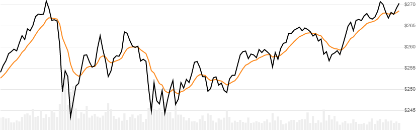

# Smoothed Moving Average (SMMA)

 Smoothed Moving Average (SMMA), Modified Moving Average (MMA), Running Moving Average (RMA) are all the same simple rolling moving average of financial market prices.  New values are calculated based on the last known value only, making a more efficient but less accurate method for computing an average.


[Smoothed Moving Average](https://en.wikipedia.org/wiki/Moving_average) is the average of price over a lookback window using a smoothing method.  SMMA is also known as modified moving average (MMA) and running moving average (RMA).
[[Discuss] &#128172;](https://github.com/DaveSkender/Stock.Indicators/discussions/375 "Community discussion about this indicator")



```csharp
// C# usage syntax
IReadOnlyList<SmmaResult> results =
  quotes.GetSmma(lookbackPeriods);
```

## Parameters

**`lookbackPeriods`** _`int`_ - Number of periods (`N`) in the moving average.  Must be greater than 0.

### Historical quotes requirements

You must have at least `2×N` or `N+100` periods of `quotes`, whichever is more, to cover the [warmup and convergence](https://github.com/DaveSkender/Stock.Indicators/discussions/688) periods.  Since this uses a smoothing technique, we recommend you use at least `N+250` data points prior to the intended usage date for better precision.

`quotes` is a collection of generic `TQuote` historical price quotes.  It should have a consistent frequency (day, hour, minute, etc).  See [the Guide](../guide.md#historical-quotes) for more information.

## Response

```csharp
IReadOnlyList<SmmaResult>
```

- This method returns a time series of all available indicator values for the `quotes` provided.
- It always returns the same number of elements as there are in the historical quotes.
- It does not return a single incremental indicator value.
- The first `N-1` periods will have `null` values since there's not enough data to calculate.

>&#9886; **Convergence warning**: The first `N+100` periods will have decreasing magnitude, convergence-related precision errors that can be as high as ~5% deviation in indicator values for earlier periods.

### SmmaResult

**`Timestamp`** _`DateTime`_ - date from evaluated `TQuote`

**`Smma`** _`double`_ - Smoothed moving average

### Utilities

- [.Condense()](../utilities.md#sort-quotes)
- [.Find(lookupDate)](../utilities.md#find-indicator-result)
- [.RemoveWarmupPeriods()](../utilities.md#get-or-exclude-nulls)
- [.RemoveWarmupPeriods(qty)](../utilities.md#get-or-exclude-nulls)

See [Utilities and helpers](../utilities.md#utilities-for-indicator-results) for more information.

## Chaining

This indicator may be generated from any chain-enabled indicator or method.

```csharp
// example
var results = quotes
    .Use(CandlePart.HL2)
    .GetSmma(..);
```

Results can be further processed on `Smma` with additional chain-enabled indicators.

```csharp
// example
var results = quotes
    .GetSmma(..)
    .GetRsi(..);
```
