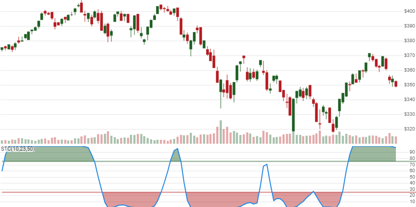

# Schaff Trend Cycle

 Created by Doug Schaff, the Schaff Trend Cycle is a stochastic oscillator view of two converging/diverging exponential moving averages.  In other words, it's a Stochastic Oscillator of Moving Average Convergence / Divergence (MACD).


Created by Doug Schaff, the [Schaff Trend Cycle](https://www.investopedia.com/articles/forex/10/schaff-trend-cycle-indicator.asp) is a stochastic oscillator view of two converging/diverging exponential moving averages.  In other words, it's a Stochastic Oscillator of Moving Average Convergence / Divergence (MACD).
[[Discuss] &#128172;](https://github.com/DaveSkender/Stock.Indicators/discussions/570 "Community discussion about this indicator")



```csharp
// C# usage syntax
IReadOnlyList<StcResult> results =
  quotes.GetStc(cyclePeriods, fastPeriods, slowPeriods);
```

## Parameters

**`cyclePeriods`** _`int`_ - Number of periods (`C`) for the Trend Cycle.  Must be greater than or equal to 0.  Default is 10.

**`fastPeriods`** _`int`_ - Number of periods (`F`) for the faster moving average.  Must be greater than 0.  Default is 23.

**`slowPeriods`** _`int`_ - Number of periods (`S`) for the slower moving average.  Must be greater than `fastPeriods`.  Default is 50.

### Historical quotes requirements

You must have at least `2×(S+C)` or `S+C+100` worth of `quotes`, whichever is more, to cover the [warmup and convergence](https://github.com/DaveSkender/Stock.Indicators/discussions/688) periods.  Since this uses a smoothing technique, we recommend you use at least `S+C+250` data points prior to the intended usage date for better precision.

`quotes` is a collection of generic `TQuote` historical price quotes.  It should have a consistent frequency (day, hour, minute, etc).  See [the Guide](../guide.md#historical-quotes) for more information.

## Response

```csharp
IReadOnlyList<StcResult>
```

- This method returns a time series of all available indicator values for the `quotes` provided.
- It always returns the same number of elements as there are in the historical quotes.
- It does not return a single incremental indicator value.
- The first `S+C` slow periods will have `null` values since there's not enough data to calculate.

>&#9886; **Convergence warning**: The first `S+C+250` periods will have decreasing magnitude, convergence-related precision errors that can be as high as ~5% deviation in indicator values for earlier periods.

### StcResult

**`Timestamp`** _`DateTime`_ - date from evaluated `TQuote`

**`Stc`** _`double`_ - Schaff Trend Cycle

### Utilities

- [.Condense()](../utilities.md#sort-quotes)
- [.Find(lookupDate)](../utilities.md#find-indicator-result)
- [.RemoveWarmupPeriods()](../utilities.md#get-or-exclude-nulls)
- [.RemoveWarmupPeriods(qty)](../utilities.md#get-or-exclude-nulls)

See [Utilities and helpers](../utilities.md#utilities-for-indicator-results) for more information.

## Chaining

This indicator may be generated from any chain-enabled indicator or method.

```csharp
// example
var results = quotes
    .Use(CandlePart.HL2)
    .GetStc(..);
```

Results can be further processed on `Stc` with additional chain-enabled indicators.

```csharp
// example
var results = quotes
    .GetStc(..)
    .GetRsi(..);
```
