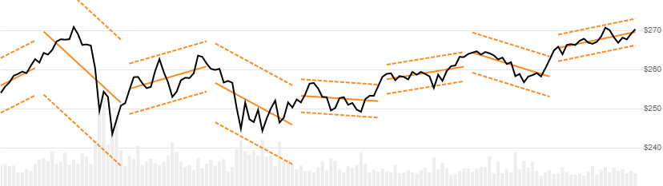
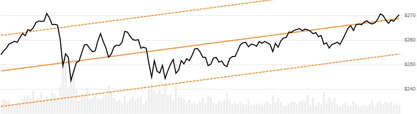

# Standard Deviation Channels

 Standard Deviation Channels are price ranges based on an linear regression centerline and standard deviations band widths.


Standard Deviation Channels are prices ranges based on an linear regression centerline and standard deviations band widths.
[[Discuss] &#128172;](https://github.com/DaveSkender/Stock.Indicators/discussions/368 "Community discussion about this indicator")



```csharp
// C# usage syntax
IReadOnlyList<StdDevChannelsResult> results =
  quotes.GetStdDevChannels(lookbackPeriods, stdDeviations);
```

## Parameters

**`lookbackPeriods`** _`int`_ - Size (`N`) of the evaluation window.  Must be `null` or greater than 1 to calculate.  A `null` value will produce a full `quotes` evaluation window ([see below](#alternative-depiction-for-full-quotes-variant)).  Default is 20.

**`stdDeviations`** _`double`_ - Width of bands.  Standard deviations (`D`) from the regression line.  Must be greater than 0.  Default is 2.

### Historical quotes requirements

You must have at least `N` periods of `quotes` to cover the warmup periods.

`quotes` is a collection of generic `TQuote` historical price quotes.  It should have a consistent frequency (day, hour, minute, etc).  See [the Guide](../guide.md#historical-quotes) for more information.

## Response

```csharp
IReadOnlyList<StdDevChannelsResult>
```

- This method returns a time series of all available indicator values for the `quotes` provided.
- It always returns the same number of elements as there are in the historical quotes.
- It does not return a single incremental indicator value.
- Up to `N-1` periods will have `null` values since there's not enough data to calculate.

> &#128073; **Repaint warning**: Historical results are a function of the current period window position and will fluctuate over time.  Recommended for visualization; not recommended for backtesting.

### StdDevChannelsResult

**`Timestamp`** _`DateTime`_ - date from evaluated `TQuote`

**`Centerline`** _`double`_ - Linear regression line (center line)

**`UpperChannel`** _`double`_ - Upper line is `D` standard deviations above the center line

**`LowerChannel`** _`double`_ - Lower line is `D` standard deviations below the center line

**`BreakPoint`** _`bool`_ - Helper information.  Indicates first point in new window.

### Utilities

- [.Condense()](../utilities.md#sort-quotes)
- [.Find(lookupDate)](../utilities.md#find-indicator-result)
- [.RemoveWarmupPeriods()](../utilities.md#get-or-exclude-nulls)
- [.RemoveWarmupPeriods(qty)](../utilities.md#get-or-exclude-nulls)

See [Utilities and helpers](../utilities.md#utilities-for-indicator-results) for more information.

## Alternative depiction for full quotes variant

If you specify `null` for the `lookbackPeriods`, you will get a regression line over the entire provided `quotes`.



## Chaining

This indicator may be generated from any chain-enabled indicator or method.

```csharp
// example
var results = quotesEval
    .Use(CandlePart.HL2)
    .GetStdDevChannels(..);
```

Results **cannot** be further chained with additional transforms.
