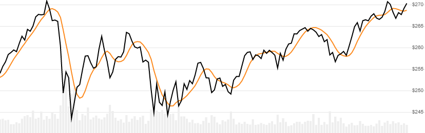

# Tillson T3 Moving Average

 Created by Tim Tillson, the T3 indicator is a smooth moving average that reduces both lag and overshooting.


Created by Tim Tillson, the [T3](https://www.forexfactory.com/attachment.php/845855?attachmentid=845855&d=1322724313) indicator is a smooth moving average that reduces both lag and overshooting.
[[Discuss] &#128172;](https://github.com/DaveSkender/Stock.Indicators/discussions/332 "Community discussion about this indicator")



```csharp
// C# usage syntax
IReadOnlyList<T3Result> results =
  quotes.GetT3(lookbackPeriods, volumeFactor);
```

## Parameters

**`lookbackPeriods`** _`int`_ - Number of periods (`N`) for the EMA smoothing.  Must be greater than 0 and is usually less than 63.  Default is 5.

**`volumeFactor`** _`double`_ - Size of the Volume Factor.  Must be greater than 0 and is usually less than 2.  Default is 0.7

### Historical quotes requirements

You must have at least `6×(N-1)+100` periods of `quotes` to cover the [warmup and convergence](https://github.com/DaveSkender/Stock.Indicators/discussions/688) periods.  Since this uses a smoothing technique, we recommend you use at least `6×(N-1)+250` data points prior to the intended usage date for better precision.

`quotes` is a collection of generic `TQuote` historical price quotes.  It should have a consistent frequency (day, hour, minute, etc).  See [the Guide](../guide.md#historical-quotes) for more information.

## Response

```csharp
IReadOnlyList<T3Result>
```

- This method returns a time series of all available indicator values for the `quotes` provided.
- It always returns the same number of elements as there are in the historical quotes.
- It does not return a single incremental indicator value.

>&#9886; **Convergence warning**: The first `6×(N-1)+250` periods will have decreasing magnitude, convergence-related precision errors that can be as high as ~5% deviation in indicator values for earlier periods.

### T3Result

**`Timestamp`** _`DateTime`_ - date from evaluated `TQuote`

**`T3`** _`double`_ - T3 Moving Average

### Utilities

- [.Condense()](../utilities.md#sort-quotes)
- [.Find(lookupDate)](../utilities.md#find-indicator-result)
- [.RemoveWarmupPeriods(qty)](../utilities.md#get-or-exclude-nulls)

See [Utilities and helpers](../utilities.md#utilities-for-indicator-results) for more information.

## Chaining

This indicator may be generated from any chain-enabled indicator or method.

```csharp
// example
var results = quotes
    .Use(CandlePart.HL2)
    .GetT3(..);
```

Results can be further processed on `T3` with additional chain-enabled indicators.

```csharp
// example
var results = quotes
    .GetT3(..)
    .GetRsi(..);
```
