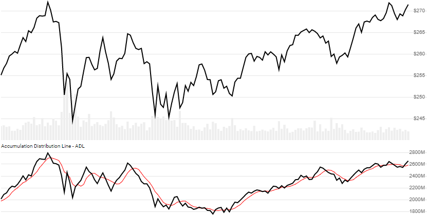

# Accumulation/Distribution Line (ADL)

Created by Marc Chaikin, the [Accumulation/Distribution Line/Index](https://en.wikipedia.org/wiki/Accumulation/distribution_index) is a rolling accumulation of Chaikin Money Flow Volume.
[[Discuss] :speech_balloon:](https://github.com/DaveSkender/Stock.Indicators/discussions/271 "Community discussion about this indicator")



```csharp
// usage
IEnumerable<AdlResult> results =
  history.GetAdl();  

// usage with optional overlay SMA of ADL (shown above)
IEnumerable<AdlResult> results =
  history.GetAdl(smaPeriod);  
```

## Parameters

| name | type | notes
| -- |-- |--
| `smaPeriod` | int | Optional.  Number of periods (`N`) in the moving average of ADL.  Must be greater than 0, if specified.

### Historical quotes requirements

You must have at least two historical quotes; however, since this is a trendline, more is recommended.

`history` is an `IEnumerable<TQuote>` collection of historical price quotes.  It should have a consistent frequency (day, hour, minute, etc).  See [the Guide](../../docs/GUIDE.md) for more information.

## Response

```csharp
IEnumerable<AdlResult>
```

We always return the same number of elements as there are in the historical quotes.

### AdlResult

| name | type | notes
| -- |-- |--
| `Date` | DateTime | Date
| `MoneyFlowMultiplier` | decimal | Money Flow Multiplier
| `MoneyFlowVolume` | decimal | Money Flow Volume
| `Adl` | decimal | Accumulation Distribution Line (ADL)
| `AdlSma` | decimal | Moving average (SMA) of ADL based on `smaPeriod` periods, if specified

:warning: **Warning**: absolute values in ADL and MFV are somewhat meaningless, so use with caution.

## Example

```csharp
// fetch historical quotes from your feed (your method)
IEnumerable<Quote> history = GetHistoryFromFeed("SPY");

// calculate
IEnumerable<AdlResult> results = history.GetAdl();

// use results as needed
AdlResult result = results.LastOrDefault();
Console.WriteLine("ADL on {0} was {1}", result.Date, result.Adl);
```

```bash
ADL on 12/31/2018 was 3439986548
```
