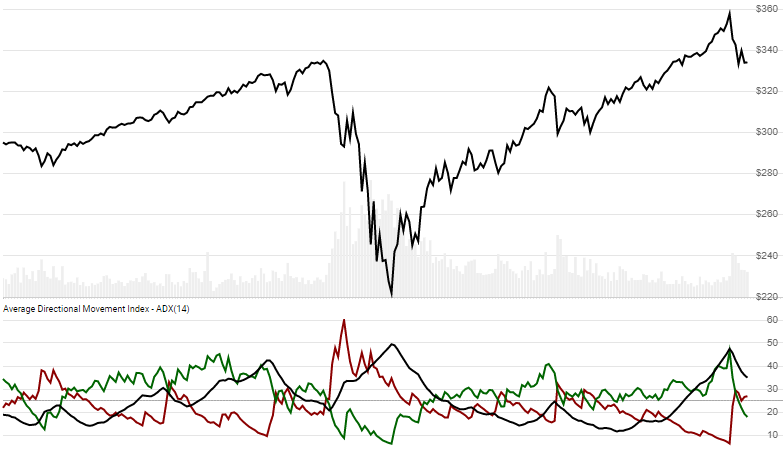

# Average Directional Index (ADX)

Created by J. Welles Wilder, the [Average Directional Movement Index](https://en.wikipedia.org/wiki/Average_directional_movement_index) is a measure of price directional movement.  It includes upward and downward indicators, and is often used to measure strength of trend.
[[Discuss] :speech_balloon:](https://github.com/DaveSkender/Stock.Indicators/discussions/270 "Community discussion about this indicator")



```csharp
// usage
IEnumerable<AdxResult> results =
  history.GetAdx(lookbackPeriod);  
```

## Parameters

| name | type | notes
| -- |-- |--
| `lookbackPeriod` | int | Number of periods (`N`) to consider.  Must be greater than 1.  Default is 14.

### Historical quotes requirements

You must have at least `2×N+100` periods of `history` to allow for smoothing convergence.  We generally recommend you use at least `2×N+250` data points prior to the intended usage date for better precision.

`history` is an `IEnumerable<TQuote>` collection of historical price quotes.  It should have a consistent frequency (day, hour, minute, etc).  See [the Guide](../../docs/GUIDE.md) for more information.

## Response

```csharp
IEnumerable<AdxResult>
```

The first `2×N-1` periods will have `null` values for ADX since there's not enough data to calculate.  We always return the same number of elements as there are in the historical quotes.

:warning: **Warning**: The first `2×N+100` periods will have decreasing magnitude, convergence-related precision errors that can be as high as ~5% deviation in indicator values for earlier periods.

### AdxResult

| name | type | notes
| -- |-- |--
| `Date` | DateTime | Date
| `Pdi` | decimal | Plus Directional Index (+DI) for `N` lookback periods
| `Mdi` | decimal | Minus Directional Index (-DI) for `N` lookback periods
| `Adx` | decimal | Average Directional Index (ADX) for `N` lookback periods

## Example

```csharp
// fetch historical quotes from your feed (your method)
IEnumerable<Quote> history = GetHistoryFromFeed("SPY");

// calculate 14-period ADX
IEnumerable<AdxResult> results = history.GetAdx(14);

// use results as needed
AdxResult result = results.LastOrDefault();
Console.WriteLine("ADX on {0} was {1}", result.Date, result.Adx);
```

```bash
ADX on 12/31/2018 was 34.30
```
