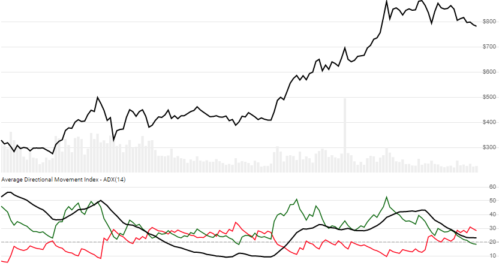

# Average Directional Index (ADX)

Measure of price directional movement.
[More info ...](https://school.stockcharts.com/doku.php?id=technical_indicators:average_directional_index_adx)



```csharp
// usage
IEnumerable<AdxResult> results = Indicator.GetAdx(history, lookbackPeriod);  
```

## Parameters

| name | type | notes
| -- |-- |--
| `history` | IEnumerable\<[Quote](../../docs/GUIDE.md#quote)\> | Historical Quotes data should be at any consistent frequency (day, hour, minute, etc).  You must supply at least 2×`N`+1 periods of `history` to get any results; however, since this uses a smoothing technique, we recommend you use at least 250 data points prior to the intended usage date for maximum precision.
| `lookbackPeriod` | int | Number of periods (`N`) to consider.  Must be greater than 1.  Default is 14.

## Response

```csharp
IEnumerable<AdxResult>
```

The first `2×N-1` periods will have `null` values for ADX since there's not enough data to calculate.  We always return the same number of elements as there are in the historical quotes.

### AdxResult

| name | type | notes
| -- |-- |--
| `Date` | DateTime | Date
| `Pdi` | decimal | Plus Directional Index (+DI) for `N` lookback periods
| `Mdi` | decimal | Minus Directional Index (-DI) for `N` lookback periods
| `Adx` | decimal | Average Directional Index (ADX) for `N` lookback periods

## Example

```csharp
// fetch historical quotes from your favorite feed, in Quote format
IEnumerable<Quote> history = GetHistoryFromFeed("SPY");

// calculate 14-period ADX
IEnumerable<AdxResult> results = Indicator.GetAdx(history,14);

// use results as needed
DateTime evalDate = DateTime.Parse("12/31/2018");
AdxResult result = results.Where(x=>x.Date==evalDate).FirstOrDefault();
Console.WriteLine("ADX on {0} was ${1}", result.Date, result.Adx);
```

```bash
ADX on 12/31/2018 was 34.30
```
