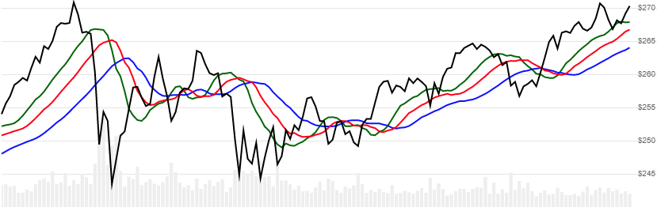

# Williams Alligator

Created by Bill Williams, Alligator is a depiction of three smoothed moving averages of median price, showing chart patterns that compared to an alligator's feeding habits when describing market movement. The moving averages are known as the Jaw, Teeth, and Lips, which are calculated using specific lookback and offset periods.  See also the [Gator Oscillator](../Gator/README.md#content).
[[Discuss] :speech_balloon:](https://github.com/DaveSkender/Stock.Indicators/discussions/385 "Community discussion about this indicator")



```csharp
// usage
IEnumerable<AlligatorResult> results = Indicator.GetAlligator(history);
```

## Parameters

| name | type | notes
| -- |-- |--
| `history` | IEnumerable\<[TQuote](../../docs/GUIDE.md#historical-quotes)\> | Historical price quotes should have a consistent frequency (day, hour, minute, etc).

### Minimum history requirements

You must supply at least 115 periods of `history`. Since this uses a smoothing technique, we recommend you use at least 265 data points prior to the intended usage date for better precision.

### Internal parameters

This indicator uses fixed interal parameters for the three moving averages of median price `(H+L)/2`.

| SMMA | Lookback | Offset
| -- |-- |--
| Jaw | 13 | 8
| Teeth | 8 | 5
| Lips | 5 | 3

## Response

```csharp
IEnumerable<AlligatorResult>
```

The first 10-20 periods will have `null` values since there's not enough data to calculate.  We always return the same number of elements as there are in the historical quotes.

:warning: **Warning**: The first 150 periods will have decreasing magnitude, convergence-related precision errors that can be as high as ~5% deviation in indicator values for earlier periods.

### AlligatorResult

| name | type | notes
| -- |-- |--
| `Date` | DateTime | Date
| `Jaw` | decimal | Alligator's Jaw
| `Teeth` | decimal | Alligator's Teeth
| `Lips` | decimal | Alligator's Lips

## Example

```csharp
// fetch historical quotes from your favorite feed, in Quote format
IEnumerable<Quote> history = GetHistoryFromFeed("MSFT");

// calculate the Williams Alligator
IEnumerable<AlligatorResult> results = Indicator.GetAlligator(history);

// use results as needed
AlligatorResult result = results.LastOrDefault();
Console.WriteLine("Jaw on {0} was ${1}", result.Date, result.Jaw);
Console.WriteLine("Teeth on {0} was ${1}", result.Date, result.Teeth);
Console.WriteLine("Lips on {0} was ${1}", result.Date, result.Lips);
```

```bash
Jaw on 12/31/2018 was $260.61
Teeth on 12/31/2018 was $252.27
Lips on 12/31/2018 was $243.89
```
