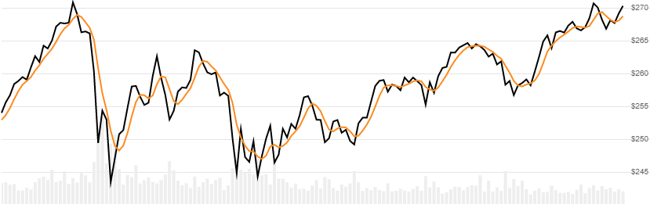

# Arnaud Legoux Moving Average (ALMA)

Created by Arnaud Legoux and Dimitrios Kouzis-Loukas, [ALMA](https://github.com/DaveSkender/Stock.Indicators/files/5654531/ALMA-Arnaud-Legoux-Moving-Average.pdf) is a Gaussian distribution weighted moving average of Close price over a lookback window.
[[Discuss] :speech_balloon:](https://github.com/DaveSkender/Stock.Indicators/discussions/209 "Community discussion about this indicator")



```csharp
// usage
IEnumerable<AlmaResult> results =
  history.GetAlma(lookbackPeriod, offset, sigma);  
```

## Parameters

| name | type | notes
| -- |-- |--
| `lookbackPeriod` | int | Number of periods (`N`) in the moving average.  Must be greater than 1, but is typically in the 5-20 range.  Default is 9.
| `offset` | double | Adjusts smoothness versus responsiveness on a scale from 0 to 1; where 1 is max responsiveness.  Default is 0.85.
| `sigma` | double | Defines the width of the Gaussian [normal distribution](https://en.wikipedia.org/wiki/Normal_distribution).  Must be greater than 0.  Default is 6.

### Historical quotes requirements

You must have at least `N` periods of `history`.

`history` is an `IEnumerable<TQuote>` collection of historical price quotes.  It should have a consistent frequency (day, hour, minute, etc).  See [the Guide](../../docs/GUIDE.md) for more information.

## Response

```csharp
IEnumerable<AlmaResult>
```

The first `N-1` periods will have `null` values since there's not enough data to calculate.  We always return the same number of elements as there are in the historical quotes.

### AlmaResult

| name | type | notes
| -- |-- |--
| `Date` | DateTime | Date
| `Alma` | decimal | Arnaud Legoux Moving Average

## Example

```csharp
// fetch historical quotes from your feed (your method)
IEnumerable<Quote> history = GetHistoryFromFeed("MSFT");

// calculate Alma(10,0.5,6)
IEnumerable<AlmaResult> results = history.GetAlma(10,0.5,6);

// use results as needed
AlmaResult result = results.LastOrDefault();
Console.WriteLine("ALMA on {0} was ${1}", result.Date, result.Alma);
```

```bash
ALMA on 12/31/2018 was $242.19
```
