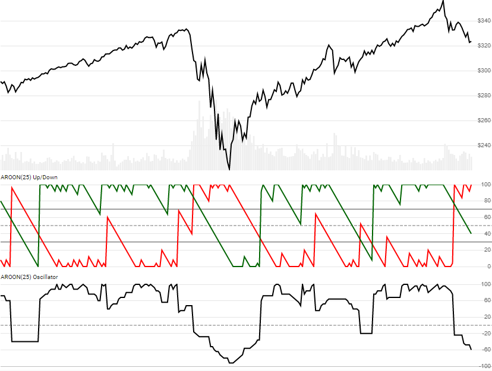

# Aroon

Aroon is a simple oscillator view of how long the new high or low price occured over a lookback period.
[More info ...](https://school.stockcharts.com/doku.php?id=technical_indicators:aroon)



```csharp
// usage
IEnumerable<AroonResult> results = Indicator.GetAroon(history, lookbackPeriod);  
```

## Parameters

| name | type | notes
| -- |-- |--
| `history` | IEnumerable\<[Quote](../../docs/GUIDE.md#quote)\> | Historical Quotes data should be at any consistent frequency (day, hour, minute, etc).  You must supply at `N` periods worth of `history`.
| `lookbackPeriod` | int | Number of periods (`N`) for the lookback evaluation.  Must be greater than 0.  Default is 25.

## Response

```csharp
IEnumerable<AroonResult>
```

The first `N-1` periods will have `null` Aroon values since there's not enough data to calculate.  We always return the same number of elements as there are in the historical quotes.

### AroonResult

| name | type | notes
| -- |-- |--
| `Date` | DateTime | Date
| `AroonUp` | decimal | Based on last High price
| `AroonDown` | decimal | Based on last Low price
| `Oscillator` | decimal | AroonUp - AroonDown

## Example

```csharp
// fetch historical quotes from your favorite feed, in Quote format
IEnumerable<Quote> history = GetHistoryFromFeed("SPY");

// calculate Aroon(25)
IEnumerable<AroonResult> results = Indicator.GetAroon(history,25);

// use results as needed
DateTime evalDate = DateTime.Parse("12/31/2018");
AroonResult result = results.Where(x=>x.Date==evalDate).FirstOrDefault();
Console.WriteLine("Aroon-Up(25) on {0} was ${1}", result.Date, result.AroonUp);
```

```bash
Aroon-Up(25) on 12/31/2018 was 28.0
```
