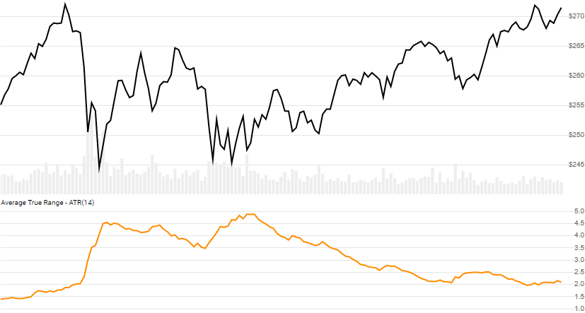

# Average True Range (ATR)

Created by J. Welles Wilder, [Average True Range](https://en.wikipedia.org/wiki/Average_true_range) is a measure of volatility that captures gaps and limits between periods.
[[Discuss] :speech_balloon:](https://github.com/DaveSkender/Stock.Indicators/discussions/269 "Community discussion about this indicator")



```csharp
// usage
IEnumerable<AtrResult> results = Indicator.GetAtr(history, lookbackPeriod);  
```

## Parameters

| name | type | notes
| -- |-- |--
| `history` | IEnumerable\<[TQuote](../../docs/GUIDE.md#quote)\> | Historical price quotes should have a consistent frequency (day, hour, minute, etc).
| `lookbackPeriod` | int | Number of periods (`N`) to consider.  Must be greater than 1.

### Minimum history requirements

You must supply at least `N+1` periods of `history`.  Since this uses a smoothing technique, we recommend you use at least `2×N` data points prior to the intended usage date for greater precision.

## Response

```csharp
IEnumerable<AtrResult>
```

The first `N-1` periods will have `null` values for ATR since there's not enough data to calculate.  We always return the same number of elements as there are in the historical quotes.

### AtrResult

| name | type | notes
| -- |-- |--
| `Date` | DateTime | Date
| `Tr` | decimal | True Range for current period
| `Atr` | decimal | Average True Range for `N` lookback periods
| `Atrp` | decimal | Average True Range Percent is `(ATR/Close Price)*100`.  This normalizes so it can be compared to other stocks.

## Example

```csharp
// fetch historical quotes from your favorite feed, in Quote format
IEnumerable<Quote> history = GetHistoryFromFeed("SPY");

// calculate 14-period ATR
IEnumerable<AtrResult> results = Indicator.GetAtr(history,14);

// use results as needed
AtrResult result = results.LastOrDefault();
Console.WriteLine("ATR on {0} was {1}", result.Date, result.Atr);
```

```bash
ATR on 12/31/2018 was 6.15
```
