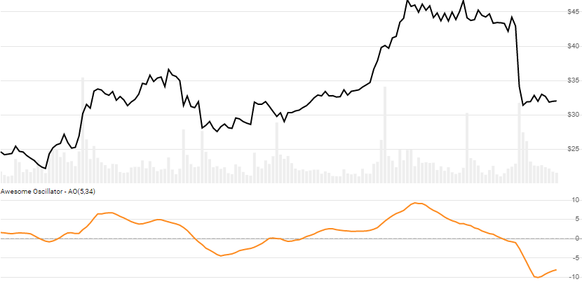

# Awesome Oscillator (AO)

Created by Bill Williams, the Awesome Oscillator (aka Super AO) is a measure of the gap between a fast and slow period modified moving average.
[[Discuss] :speech_balloon:](https://github.com/DaveSkender/Stock.Indicators/discussions/282 "Community discussion about this indicator")



```csharp
// usage
IEnumerable<AwesomeResult> results =
  Indicator.GetAwesome(history, fastPeriod, slowPeriod);  
```

## Parameters

| name | type | notes
| -- |-- |--
| `history` | IEnumerable\<[TQuote](../../docs/GUIDE.md#historical-quotes)\> | Historical price quotes should have a consistent frequency (day, hour, minute, etc).
| `fastPeriod` | int | Number of periods (`F`) for the faster moving average.  Must be greater than 0.  Default is 5.
| `slowPeriod` | int | Number of periods (`S`) for the slower moving average.  Must be greater than `fastPeriod`.  Default is 34.

### Minimum history requirements

You must supply at least `S` periods of `history`.

## Response

```csharp
IEnumerable<AwesomeResult>
```

The first period `S-1` periods will have `null` values since there's not enough data to calculate.  We always return the same number of elements as there are in the historical quotes.

### AwesomeResult

| name | type | notes
| -- |-- |--
| `Date` | DateTime | Date
| `Oscillator` | decimal | Awesome Oscillator
| `Normalized` | decimal | `100 × Oscillator ÷ (median price)`

## Example

```csharp
// fetch historical quotes from your favorite feed, in Quote format
IEnumerable<Quote> history = GetHistoryFromFeed("MSFT");

// calculate
IEnumerable<AwesomeResult> results = Indicator.GetAwesome(history,5,34);

// use results as needed
AwesomeResult r = results.LastOrDefault();
Console.WriteLine("AO on {0} was {1}", r.Date, r.Oscillator);
```

```bash
AO on 12/31/2018 was -17.77
```
