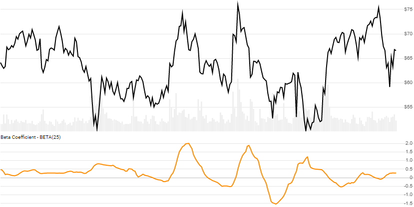

# Beta Coefficient

[Beta](https://en.wikipedia.org/wiki/Beta_(finance)) shows how strongly one stock responds to systemic volatility of the entire market.
[[Discuss] :speech_balloon:](https://github.com/DaveSkender/Stock.Indicators/discussions/268 "Community discussion about this indicator")



```csharp
// usage
IEnumerable<BetaResult> results =
  Indicator.GetBeta(historyMarket, historyEval, lookbackPeriod);  
```

## Parameters

| name | type | notes
| -- |-- |--
| `historyMarket` | IEnumerable\<[TQuote](../../docs/GUIDE.md#historical-quotes)\> | Historical [market] Quotes data should be at any consistent frequency (day, hour, minute, etc).  This `market` history will be used to establish the baseline.
| `historyEval` | IEnumerable\<[TQuote](../../docs/GUIDE.md#historical-quotes)\> | Historical [evaluation stock] Quotes data should be at any consistent frequency (day, hour, minute, etc).
| `lookbackPeriod` | int | Number of periods (`N`) in the lookback period.  Must be greater than 0 to calculate; however we suggest a larger period for statistically appropriate sample size.

### Historical quotes requirements

You must have at least `N` periods of history.  You must have at least the same matching date elements of `historyMarket`.  Exception will be thrown if not matched.  Historical price quotes should have a consistent frequency (day, hour, minute, etc).

## Response

```csharp
IEnumerable<BetaResult>
```

The first `N-1` periods will have `null` values since there's not enough data to calculate.  We always return the same number of elements as there are in the historical quotes.

### BetaResult

| name | type | notes
| -- |-- |--
| `Date` | DateTime | Date
| `Beta` | decimal | Beta coefficient based on `N` lookback periods

## Example

```csharp
// fetch historical quotes from your feed (your method)
IEnumerable<Quote> historyTSLA = GetHistoryFromFeed("TSLA");
IEnumerable<Quote> historySPX = GetHistoryFromFeed("SPX");

// calculate 20-period Beta coefficient
IEnumerable<BetaResult> results =
  Indicator.GetBeta(historySPX,historyTSLA,20);

// use results as needed
BetaResult result = results.LastOrDefault();
Console.WriteLine("Beta(SPX,TSLA,20) on {0} was {1}",
  result.Date, result.Beta);
```

```bash
Beta(SPX,TSLA,20) on 12/31/2018 was 1.676
```
