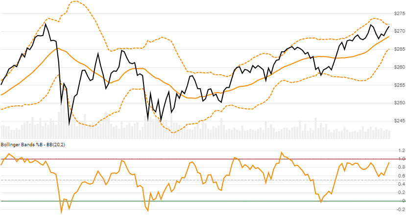

# Bollinger Bands&#174;

Created by John Bollinger, [Bollinger Bands](https://en.wikipedia.org/wiki/Bollinger_Bands) depict volatility as standard deviation boundary lines from a moving average of Close price.  Bollinger Bands&#174; is a registered trademark of John A. Bollinger.
[[Discuss] :speech_balloon:](https://github.com/DaveSkender/Stock.Indicators/discussions/267 "Community discussion about this indicator")



```csharp
// usage
IEnumerable<BollingerBandsResult> results =
  Indicator.GetBollingerBands(history, lookbackPeriod, standardDeviation);  
```

## Parameters

| name | type | notes
| -- |-- |--
| `history` | IEnumerable\<[TQuote](../../docs/GUIDE.md#historical-quotes)\> | Historical price quotes should have a consistent frequency (day, hour, minute, etc).
| `lookbackPeriod` | int | Number of periods (`N`) for the center line moving average.  Must be greater than 1 to calculate; however we suggest a larger period for statistically appropriate sample size.  Default is 20.
| `standardDeviations` | int | Width of bands.  Standard deviations (`D`) from the moving average.  Must be greater than 0.  Default is 2.

### Minimum history requirements

You must supply at least `N` periods of `history`.

## Response

```csharp
IEnumerable<BollingerBandsResult>
```

The first `N-1` periods will have `null` values since there's not enough data to calculate.  We always return the same number of elements as there are in the historical quotes.

### BollingerBandsResult

| name | type | notes
| -- |-- |--
| `Date` | DateTime | Date
| `Sma` | decimal | Simple moving average (SMA) of Close price (center line)
| `UpperBand` | decimal | Upper line is `D` standard deviations above the SMA
| `LowerBand` | decimal | Lower line is `D` standard deviations below the SMA
| `PercentB` | decimal | `%B` is the location within the bands.  `(Price-LowerBand)/(UpperBand-LowerBand)`
| `ZScore` | decimal | Z-Score of current Close price (number of standard deviations from mean)
| `Width` | decimal | Width as percent of SMA price.  `(UpperBand-LowerBand)/Sma`

## Example

```csharp
// fetch historical quotes from your favorite feed, in Quote format
IEnumerable<Quote> history = GetHistoryFromFeed("SPY");

// calculate BollingerBands(12,26,9)
IEnumerable<BollingerBandsResult> results =
  Indicator.GetBollingerBands(history,20,2);

// use results as needed
BollingerBandsResult result = results.LastOrDefault();
Console.WriteLine("Upper Bollinger Band on {0} was ${1}",
  result.Date, result.UpperBand);
```

```bash
Upper Bollinger Band on 12/31/2018 was $273.7
```
