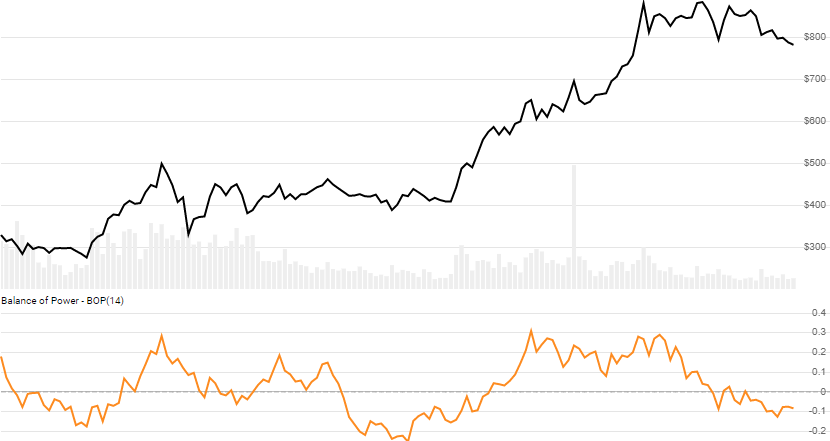

# Balance of Power (BOP)

Created by Igor Levshin, the [Balance of Power](https://school.stockcharts.com/doku.php?id=technical_indicators:balance_of_power) (aka Balance of Market Power) is a momentum oscillator that depicts the strength of buying and selling pressure.
[[Discuss] :speech_balloon:](https://github.com/DaveSkender/Stock.Indicators/discussions/302 "Community discussion about this indicator")



```csharp
// usage
IEnumerable<BopResult> results =
  history.GetBop(smoothPeriod);  
```

## Parameters

| name | type | notes
| -- |-- |--
| `smoothPeriod` | int | Number of periods (`N`) for smoothing.  Must be greater than 0.  Default is 14.

### Historical quotes requirements

You must have at least `N` periods of `history`.

`history` is an `IEnumerable<TQuote>` collection of historical price quotes.  It should have a consistent frequency (day, hour, minute, etc).  See [the Guide](../../docs/GUIDE.md) for more information.

## Response

```csharp
IEnumerable<BopResult>
```

The first `N-1` periods will have `null` values since there's not enough data to calculate.  We always return the same number of elements as there are in the historical quotes.

### BopResult

| name | type | notes
| -- |-- |--
| `Date` | DateTime | Date
| `Bop` | decimal | Balance of Power

## Example

```csharp
// fetch historical quotes from your feed (your method)
IEnumerable<Quote> history = GetHistoryFromFeed("MSFT");

// calculate 14-period BOP
IEnumerable<BopResult> results = history.GetBop(14);

// use results as needed
BopResult result = results.LastOrDefault();
Console.WriteLine("BOP on {0} was {1}", result.Date, result.Bop);
```

```bash
BOP on 12/31/2018 was 0.29
```
