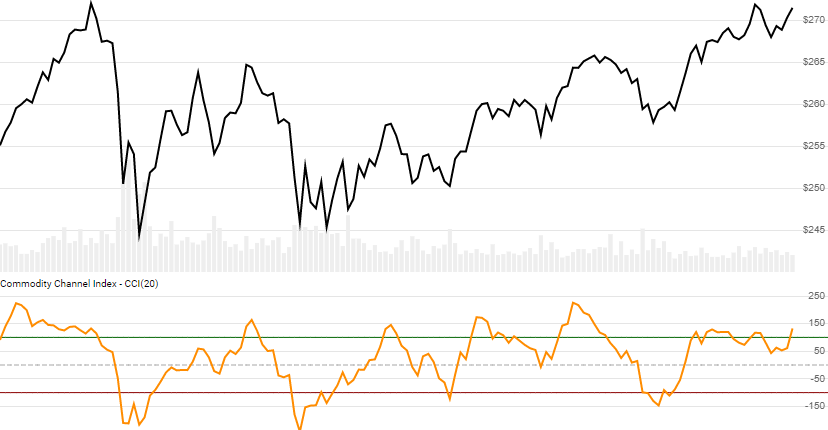

# Commodity Channel Index (CCI)

Created by Donald Lambert, the [Commodity Channel Index](https://en.wikipedia.org/wiki/Commodity_channel_index) is an oscillator depicting deviation from typical price range, often used to identify cyclical trends.
[[Discuss] :speech_balloon:](https://github.com/DaveSkender/Stock.Indicators/discussions/265 "Community discussion about this indicator")



```csharp
// usage
IEnumerable<CciResult> results =
  history.GetCci(lookbackPeriod);  
```

## Parameters

| name | type | notes
| -- |-- |--
| `lookbackPeriod` | int | Number of periods (`N`) in the moving average.  Must be greater than 0.  Default is 20.

### Historical quotes requirements

You must have at least `N+1` periods of `history`.

`history` is an `IEnumerable<TQuote>` collection of historical price quotes.  It should have a consistent frequency (day, hour, minute, etc).  See [the Guide](../../docs/GUIDE.md) for more information.

## Response

```csharp
IEnumerable<CciResult>
```

The first `N-1` periods will have `null` values since there's not enough data to calculate.  We always return the same number of elements as there are in the historical quotes.

### CciResult

| name | type | notes
| -- |-- |--
| `Date` | DateTime | Date
| `Cci` | decimal | CCI value for `N` lookback periods

## Example

```csharp
// fetch historical quotes from your feed (your method)
IEnumerable<Quote> history = GetHistoryFromFeed("SPY");

// calculate 20-period CCI
IEnumerable<CciResult> results = history.GetCci(20);

// use results as needed
CciResult result = results.LastOrDefault();
Console.WriteLine("CCI on {0} was {1}", result.Date, result.Cci);
```

```bash
CCI on 12/31/2018 was -52.99
```
