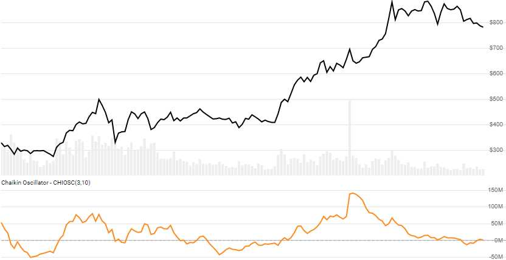

# Chaikin Oscillator

Created by Marc Chaikin, the [Chaikin Oscillator](https://en.wikipedia.org/wiki/Chaikin_Analytics#Chaikin_Oscillator) is the difference between fast and slow Exponential Moving Averages (EMA) of the [Accumulation/Distribution Line](../adl/README.md) (ADL).
[[Discuss] :speech_balloon:](https://github.com/DaveSkender/Stock.Indicators/discussions/264 "Community discussion about this indicator")



```csharp
// usage
IEnumerable<ChaikinOscResult> results = Indicator.GetChaikinOsc(history, fastPeriod, slowPeriod);  
```

## Parameters

| name | type | notes
| -- |-- |--
| `history` | IEnumerable\<[TQuote](../../docs/GUIDE.md#historical-quotes)\> | Historical price quotes should have a consistent frequency (day, hour, minute, etc).
| `fastPeriod` | int | Number of periods (`F`) in the ADL fast EMA.  Must be greater than 0 and smaller than `S`.  Default is 3.
| `slowPeriod` | int | Number of periods (`S`) in the ADL slow EMA.  Must be greater `F`.  Default is 10.

### Minimum history requirements

You must supply at least `2×S` or `S+100` periods of `history`, whichever is more.  Since this uses a smoothing technique, we recommend you use at least `S+250` data points prior to the intended usage date for better precision.

## Response

```csharp
IEnumerable<ChaikinOscResult>
```

The first `S-1` periods will have `null` values for `Oscillator` since there's not enough data to calculate.  We always return the same number of elements as there are in the historical quotes.

:warning: **Warning**: The first `S+100` periods will have decreasing magnitude, convergence-related precision errors that can be as high as ~5% deviation in indicator values for earlier periods.

### ChaikinOscResult

| name | type | notes
| -- |-- |--
| `Date` | DateTime | Date
| `MoneyFlowMultiplier` | decimal | Money Flow Multiplier
| `MoneyFlowVolume` | decimal | Money Flow Volume
| `Adl` | decimal | Accumulation Distribution Line (ADL)
| `Oscillator` | decimal | Chaikin Oscillator

:warning: **Warning**: absolute values in MFV, ADL, and Oscillator are somewhat meaningless, so use with caution.

## Example

```csharp
// fetch historical quotes from your favorite feed, in Quote format
IEnumerable<Quote> history = GetHistoryFromFeed("SPY");

// calculate 20-period Chaikin Oscillator
IEnumerable<ChaikinOscResult> results = Indicator.GetChaikinOsc(history,20);

// use results as needed
ChaikinOscResult result = results.LastOrDefault();
Console.WriteLine("Chaikin Oscillator on {0} was {1}", result.Date, result.ChaikinOsc);
```

```bash
Chaikin Oscillator on 12/31/2018 was -19135200
```
