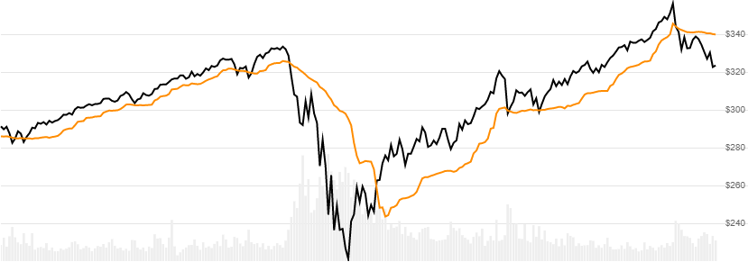

# Chandelier Exit

Created by Charles Le Beau, the [Chandelier Exit](https://school.stockcharts.com/doku.php?id=technical_indicators:chandelier_exit) is typically used for stop-loss and can be computed for both long or short types.
[[Discuss] :speech_balloon:](https://github.com/DaveSkender/Stock.Indicators/discussions/263 "Community discussion about this indicator")



```csharp
// usage
IEnumerable<ChandelierResult> results =
  history.GetChandelier(lookbackPeriod, multiplier, type);  
```

## Parameters

| name | type | notes
| -- |-- |--
| `lookbackPeriod` | int | Number of periods (`N`) for the lookback evaluation.  Default is 22.
| `multiplier` | decimal | Multiplier number must be a positive value.  Default is 3.
| `type` | ChandelierType | Direction of exit.  See [ChandelierType options](#chandeliertype-options) below.  Default is `ChandelierType.Long`.

### Historical quotes requirements

You must have at least `N+1` periods of `history`.

`history` is an `IEnumerable<TQuote>` collection of historical price quotes.  It should have a consistent frequency (day, hour, minute, etc).  See [the Guide](../../docs/GUIDE.md) for more information.

### ChandelierType options

| type | description
|-- |--
| `ChandelierType.Long` | Intended as stop loss value for long positions. (default)
| `ChandelierType.Short` | Intended as stop loss value for short positions.

## Response

```csharp
IEnumerable<ChandelierResult>
```

The first `N` periods will have `null` Chandelier values since there's not enough data to calculate.  We always return the same number of elements as there are in the historical quotes.

### ChandelierResult

| name | type | notes
| -- |-- |--
| `Date` | DateTime | Date
| `ChandelierExit` | decimal | Exit line

## Example

```csharp
// fetch historical quotes from your feed (your method)
IEnumerable<Quote> history = GetHistoryFromFeed("SPY");

// calculate Chandelier(22,3,LONG)
IEnumerable<ChandelierResult> results =
  history.GetChandelier(22,3,ChandelierType.Long);

// use results as needed
ChandelierResult result = results.LastOrDefault();
Console.WriteLine("ChandelierExit(22,3) on {0} was ${1}",
  result.Date, result.ChandelierExit);
```

```bash
ChandelierExit(22,3) on 12/31/2018 was $255.09
```
