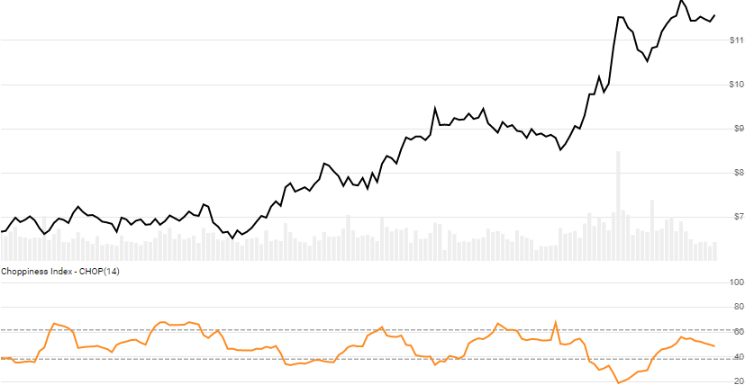

# Choppiness Index

Created by E.W. Dreiss, the Choppiness Index measures the trendiness or choppiness on a scale of 0 to 100, to depict steady trends versus conditions of choppiness.  [[Discuss] :speech_balloon:](https://github.com/DaveSkender/Stock.Indicators/discussions/357 "Community discussion about this indicator")



```csharp
// usage
IEnumerable<ChopResult> results =
  history.GetChop(lookbackPeriod);  
```

## Parameters

| name | type | notes
| -- |-- |--
| `lookbackPeriod` | int | Number of periods (`N`) for the lookback evaluation.  Must be greater than 1.  Default is 14.

### Historical quotes requirements

You must have at least `N+1` periods of `history`.

`history` is an `IEnumerable<TQuote>` collection of historical price quotes.  It should have a consistent frequency (day, hour, minute, etc).  See [the Guide](../../docs/GUIDE.md) for more information.

## Response

```csharp
IEnumerable<ChopResult>
```

The first `N` periods will have `null` values since there's not enough data to calculate.  We always return the same number of elements as there are in the historical quotes.

### ChopResult

| name | type | notes
| -- |-- |--
| `Date` | DateTime | Date
| `Chop` | decimal | Choppiness Index

## Example

```csharp
// fetch historical quotes from your feed (your method)
IEnumerable<Quote> history = GetHistoryFromFeed("SPY");

// calculate CHOP(14)
IEnumerable<ChopResult> results = history.GetChop(14);

// use results as needed
ChopResult result = results.LastOrDefault();
Console.WriteLine("CHOP(14) on {0} was {1}", result.Date, result.Chop);
```

```bash
CHOP(14) on 12/31/2018 was 38.65 
```
