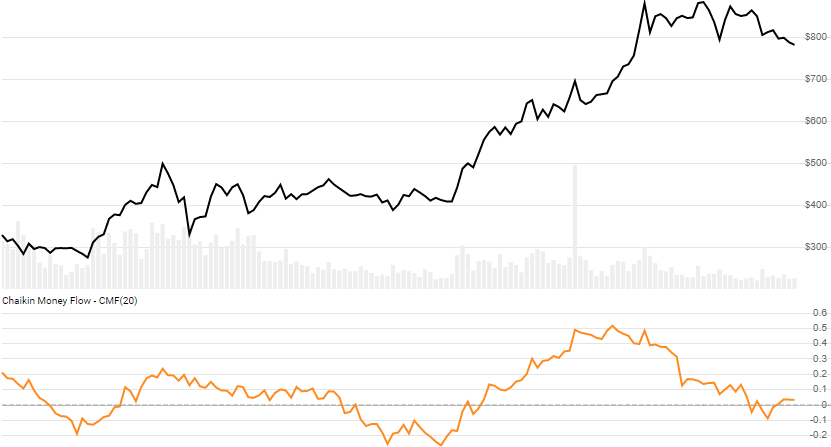

# Chaikin Money Flow (CMF)

[Chaikin Money Flow](https://en.wikipedia.org/wiki/Chaikin_Analytics#Chaikin_Money_Flow) is the simple moving average of the Money Flow Volume over `N` lookback periods.



```csharp
// usage
IEnumerable<CmfResult> results = Indicator.GetCmf(history, lookbackPeriod);  
```

## Parameters

| name | type | notes
| -- |-- |--
| `history` | IEnumerable\<[TQuote](../../docs/GUIDE.md#quote)\> | Historical Quotes data should be at any consistent frequency (day, hour, minute, etc).  You must supply at least `N+1` periods of `history`.
| `lookbackPeriod` | int | Number of periods (`N`) in the moving average.  Must be greater than 0.  Default is 20.

## Response

```csharp
IEnumerable<CmfResult>
```

The first `N-1` periods will have `null` values since there's not enough data to calculate.  We always return the same number of elements as there are in the historical quotes.

### CmfResult

| name | type | notes
| -- |-- |--
| `Date` | DateTime | Date
| `MoneyFlowMultiplier` | decimal | Money Flow Multiplier
| `MoneyFlowVolume` | decimal | Money Flow Volume
| `Cmf` | decimal | Chaikin Money Flow = SMA of MFV for `N` lookback periods

**Warning**: absolute values in MFV and CMF are somewhat meaningless, so use with caution.

## Example

```csharp
// fetch historical quotes from your favorite feed, in Quote format
IEnumerable<Quote> history = GetHistoryFromFeed("SPY");

// calculate 20-period CMF
IEnumerable<CmfResult> results = Indicator.GetCmf(history,20);

// use results as needed
CmfResult result = results.LastOrDefault();
Console.WriteLine("CMF on {0} was {1}", result.Date, result.Cmf);
```

```bash
CMF on 12/31/2018 was -20257894
```
