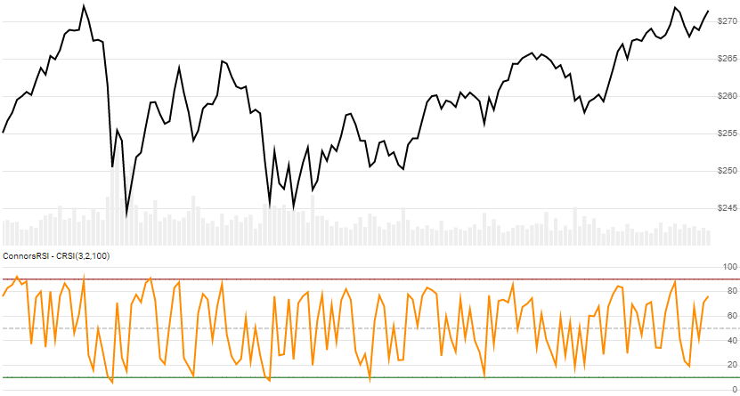

# ConnorsRSI

Created by Laurence Connors, the [ConnorsRSI](https://alvarezquanttrading.com/wp-content/uploads/2016/05/ConnorsRSIGuidebook.pdf) is a composite oscillator that incorporates RSI, winning/losing streaks, and percentile gain metrics on scale of 0 to 100.  See [analysis](https://alvarezquanttrading.com/blog/connorsrsi-analysis).
[[Discuss] :speech_balloon:](https://github.com/DaveSkender/Stock.Indicators/discussions/260 "Community discussion about this indicator")



```csharp
// usage
IEnumerable<ConnorsRsiResult> results = Indicator.GetConnorsRsi(history, rsiPeriod, streakPeriod, rankPeriod);  
```

## Parameters

| name | type | notes
| -- |-- |--
| `history` | IEnumerable\<[TQuote](../../docs/GUIDE.md#historical-quotes)\> | Historical price quotes should have a consistent frequency (day, hour, minute, etc).
| `rsiPeriod` | int | Lookback period (`R`) for the close price RSI.  Must be greater than 1.  Default is 3.
| `streakPeriod` | int | Lookback period (`S`) for the streak RSI.  Must be greater than 1.  Default is 2.
| `rankPeriod` | int | Lookback period (`P`) for the Percentile Rank.  Must be greater than 1.  Default is 100.

### Minimum history requirements

`N` is the greater of `R+100` and `S`, and `P+2`.  You must supply at least `N` periods of `history`.  Since this uses a smoothing technique, we recommend you use at least `N+150` data points prior to the intended usage date for better precision.

## Response

```csharp
IEnumerable<ConnorsRsiResult>
```

The first `R+S+P-1` periods will have `null` values since there's not enough data to calculate.  We always return the same number of elements as there are in the historical quotes.

:warning: **Warning**: The first `N` periods will have decreasing magnitude, convergence-related precision errors that can be as high as ~5% deviation in indicator values for earlier periods.

### ConnorsRsiResult

| name | type | notes
| -- |-- |--
| `Date` | DateTime | Date
| `RsiClose` | decimal | RSI(`R`) of the Close price.
| `RsiStreak` | decimal | RSI(`S`) of the Streak.
| `PercentRank` | decimal | Percentile rank of the period gain value.
| `ConnorsRsi` | decimal | ConnorsRSI

## Example

```csharp
// fetch historical quotes from your favorite feed, in Quote format
IEnumerable<Quote> history = GetHistoryFromFeed("SPY");

// calculate ConnorsRsi(3,2.100)
IEnumerable<ConnorsRsiResult> results = Indicator.GetConnorsRsi(history,3,2,100);

// use results as needed
ConnorsRsiResult result = results.LastOrDefault();
Console.WriteLine("ConnorsRSI on {0} was {1}", result.Date, result.ConnorsRsi);
```

```bash
ConnorsRSI on 12/31/2018 was 74.77
```
