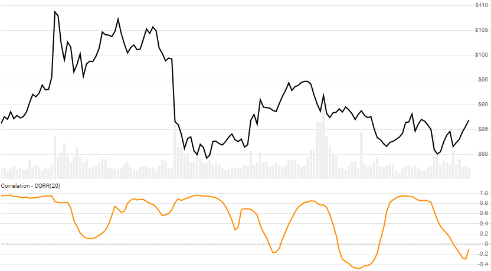

# Correlation Coefficient

[Correlation Coefficient](https://en.wikipedia.org/wiki/Correlation_coefficient) between two quote histories, based on Close price.  R-Squared (R&sup2;), Variance, and Covariance are also output.
[[Discuss] :speech_balloon:](https://github.com/DaveSkender/Stock.Indicators/discussions/259 "Community discussion about this indicator")



```csharp
// usage
IEnumerable<CorrResult> results =
  historyA.GetCorr(historyB, lookbackPeriod);  
```

## Parameters

| name | type | notes
| -- |-- |--
| `historyB` | IEnumerable\<[TQuote](../../docs/GUIDE.md#historical-quotes)\> | Historical quotes (B) must have at least the same matching date elements of `historyA`.
| `lookbackPeriod` | int | Number of periods (`N`) in the lookback period.  Must be greater than 0 to calculate; however we suggest a larger period for statistically appropriate sample size.

### Historical quotes requirements

You must have at least `N` periods for both versions of `history`.  Mismatch histories will produce a `BadHistoryException`.  Historical price quotes should have a consistent frequency (day, hour, minute, etc).

`historyA` is an `IEnumerable<TQuote>` collection of historical price quotes.  It should have a consistent frequency (day, hour, minute, etc).  See [the Guide](../../docs/GUIDE.md) for more information.

## Response

```csharp
IEnumerable<CorrResult>
```

The first `N-1` periods will have `null` values since there's not enough data to calculate.  We always return the same number of elements as there are in the historical quotes.

### CorrResult

| name | type | notes
| -- |-- |--
| `Date` | DateTime | Date
| `VarianceA` | decimal | Variance of A based on `N` lookback periods
| `VarianceB` | decimal | Variance of B based on `N` lookback periods
| `Covariance` | decimal | Covariance of A+B based on `N` lookback periods
| `Correlation` | decimal | Correlation `R` based on `N` lookback periods
| `RSquared` | decimal | R-Squared (R&sup2;), aka Coefficient of Determination.  Simple linear regression models is used (square of Correlation).

## Example

```csharp
// fetch historical quotes from your feed (your method)
IEnumerable<Quote> historySPX = GetHistoryFromFeed("SPX");
IEnumerable<Quote> historyTSLA = GetHistoryFromFeed("TSLA");

// calculate 20-period Correlation
IEnumerable<CorrResult> results = historySPX.GetCorr(historyTSLA,20);

// use results as needed
CorrResult result = results.LastOrDefault();
Console.WriteLine("CORR(SPX,TSLA,20) on {0} was {1}", result.Date, result.Corr);
```

```bash
CORR(SPX,TSLA,20) on 12/31/2018 was 0.85
```
