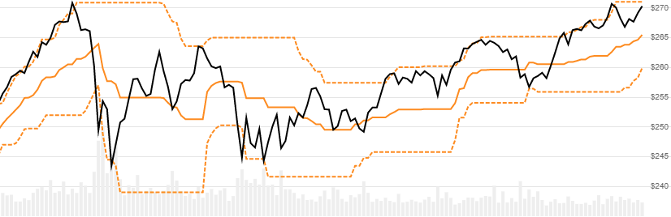

# Donchian Channels (Price Channels)

Created by Richard Donchian, [Donchian Channels](https://en.wikipedia.org/wiki/Donchian_channel), also called Price Channels, are derived from highest High and lowest Low values over a lookback window.
[[Discuss] :speech_balloon:](https://github.com/DaveSkender/Stock.Indicators/discussions/257 "Community discussion about this indicator")



```csharp
// usage
IEnumerable<DonchianResult> results = Indicator.GetDonchian(history, lookbackPeriod);  
```

## Parameters

| name | type | notes
| -- |-- |--
| `history` | IEnumerable\<[TQuote](../../docs/GUIDE.md#historical-quotes)\> | Historical price quotes should have a consistent frequency (day, hour, minute, etc).
| `lookbackPeriod` | int | Number of periods (`N`) for lookback period.  Must be greater than 0 to calculate; however we suggest a larger value for an appropriate sample size.  Default is 20.

### Minimum history requirements

You must supply at least `N+1` periods of `history`.

## Response

```csharp
IEnumerable<DonchianResult>
```

The first `N` periods will have `null` values since there's not enough data to calculate.  We always return the same number of elements as there are in the historical quotes.

### DonchianResult

| name | type | notes
| -- |-- |--
| `Date` | DateTime | Date
| `UpperBand` | decimal | Upper line is the highest High over `N` periods
| `Centerline` | decimal | Simple average of Upper and Lower bands
| `LowerBand` | decimal | Lower line is the lowest Low over `N` periods
| `Width` | decimal | Width as percent of Centerline price.  `(UpperBand-LowerBand)/Centerline`

## Example

```csharp
// fetch historical quotes from your favorite feed, in Quote format
IEnumerable<Quote> history = GetHistoryFromFeed("SPY");

// calculate Donchian(20)
IEnumerable<DonchianResult> results = Indicator.GetDonchian(history,20);

// use results as needed
DonchianResult result = results.LastOrDefault();
Console.WriteLine("Upper Donchian Channel on {0} was ${1}", result.Date, result.UpperBand);
```

```bash
Upper Donchian Channel on 12/31/2018 was $273.59
```
