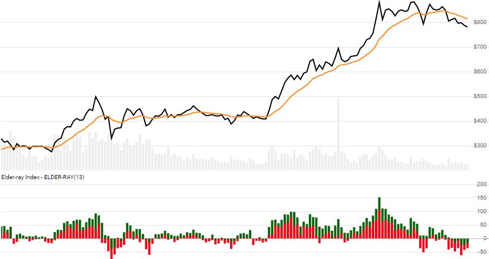

# Elder-ray Index

Created by Alexander Elder, the [Elder-ray Index](https://www.investopedia.com/terms/e/elderray.asp), also known as Bull and Bear Power, depicts buying and selling pressure.
[[Discuss] :speech_balloon:](https://github.com/DaveSkender/Stock.Indicators/discussions/378 "Community discussion about this indicator")



```csharp
// usage
IEnumerable<ElderRayResult> results =
  history.GetElderRay(lookbackPeriod);  
```

## Parameters

| name | type | notes
| -- |-- |--
| `lookbackPeriod` | int | Number of periods (`N`) for the underlying EMA evaluation.  Must be greater than 0.  Default is 13.

### Historical quotes requirements

You must have at least `2×N` or `N+100` periods of `history`, whichever is more.  Since this uses a smoothing technique, we recommend you use at least `N+250` data points prior to the intended usage date for better precision.

`history` is an `IEnumerable<TQuote>` collection of historical price quotes.  It should have a consistent frequency (day, hour, minute, etc).  See [the Guide](../../docs/GUIDE.md) for more information.

## Response

```csharp
IEnumerable<ElderRayResult>
```

The first `N-1` periods will have `null` indicator values since there's not enough data to calculate.
We always return the same number of elements as there are in the historical quotes.

:warning: **Warning**: The first `N+100` periods will have decreasing magnitude, convergence-related precision errors that can be as high as ~5% deviation in indicator values for earlier periods.

### ElderRayResult

| name | type | notes
| -- |-- |--
| `Date` | DateTime | Date
| `Ema` | decimal | Exponential moving average of Close price
| `BullPower` | decimal | Bull Power
| `BearPower` | decimal | Bear Power

## Example

```csharp
// fetch historical quotes from your feed (your method)
IEnumerable<Quote> history = GetHistoryFromFeed("SPY");

// calculate ElderRay(13)
IEnumerable<ElderRayResult> results
  = history.GetElderRay(13);

// use results as needed
ElderRayResult r = results.LastOrDefault();
Console.WriteLine("Elder-ray(13) Bull Power on {0} was {1}",
  r.Date, r.BullPower);
```

```bash
Elder-ray(13) Bull Power on 12/31/2018 was -0.47
```
