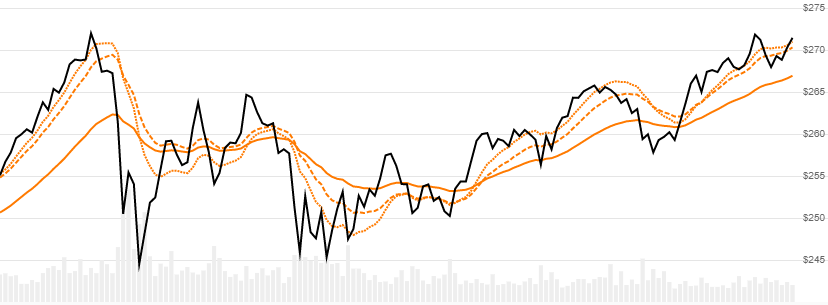

# Exponential Moving Average (EMA), Double EMA (DEMA), and Triple EMA (TEMA)

[Exponentially weighted moving average](https://en.wikipedia.org/wiki/Moving_average#Exponential_moving_average) of the Close price over a lookback window.  Double and Triple variants are also available.  Note: [TEMA](https://en.wikipedia.org/wiki/Triple_exponential_moving_average) is often confused with the alternative [TRIX](../Trix/README.md) oscillator.
[[Discuss] :speech_balloon:](https://github.com/DaveSkender/Stock.Indicators/discussions/256 "Community discussion about this indicator")



```csharp
// usage for EMA (standard)
IEnumerable<EmaResult> results = Indicator.GetEma(history, lookbackPeriod);

// usage for Double EMA
IEnumerable<EmaResult> results = Indicator.GetDoubleEma(history, lookbackPeriod);

// usage for Triple EMA
IEnumerable<EmaResult> results = Indicator.GetTripleEma(history, lookbackPeriod);
```

## Parameters

| name | type | notes
| -- |-- |--
| `history` | IEnumerable\<[TQuote](../../docs/GUIDE.md#historical-quotes)\> | Historical price quotes should have a consistent frequency (day, hour, minute, etc).
| `lookbackPeriod` | int | Number of periods (`N`) in the moving average.  Must be greater than 0.

### Minimum history requirements

**EMA** (standard): You must supply at least `2×N` or `N+100` periods of `history`, whichever is more.  Since this uses a smoothing technique, we recommend you use at least `N+250` data points prior to the intended usage date for better precision.

**Double EMA**: You must supply at least `3×N` or `2×N+100` periods of `history`, whichever is more.  Since this uses a smoothing technique, we recommend you use at least `2×N+250` data points prior to the intended usage date for better precision.

**Triple EMA**: You must supply at least `4×N` or `3×N+100` periods of `history`, whichever is more.  Since this uses a smoothing technique, we recommend you use at least `3×N+250` data points prior to the intended usage date for better precision.

## Response

```csharp
IEnumerable<EmaResult>
```

We always return the same number of elements as there are in the historical quotes.

Standard EMA: The first `N-1` periods will have `null` values since there's not enough data to calculate.

Double EMA: The first `2×N-1` periods will have `null` values since there's not enough data to calculate.

Triple EMA: The first `3×N-2` periods will have `null` values since there's not enough data to calculate.  Also note that we are using the proper [weighted variant](https://en.wikipedia.org/wiki/Triple_exponential_moving_average) for TEMA.  If you prefer the unweighted raw 3 EMAs value, please use the `Ema3` output from the [TRIX](../Trix/README.md) oscillator instead.

:warning: **Warning**: The first respective `N+100`, `2×N+100`, and `3×N+100` periods will have decreasing magnitude, convergence-related precision errors that can be as high as ~5% deviation in indicator values for earlier periods.

### EmaResult

| name | type | notes
| -- |-- |--
| `Date` | DateTime | Date
| `Ema` | decimal | Exponential moving average for `N` lookback period

## Example

```csharp
// fetch historical quotes from your favorite feed, in Quote format
IEnumerable<Quote> history = GetHistoryFromFeed("SPY");

// calculate 20-period EMA
IEnumerable<EmaResult> results = Indicator.GetEma(history,20);

// use results as needed
EmaResult result = results.LastOrDefault();
Console.WriteLine("EMA on {0} was ${1}", result.Date, result.Ema);
```

```bash
EMA on 12/31/2018 was $249.35
```
