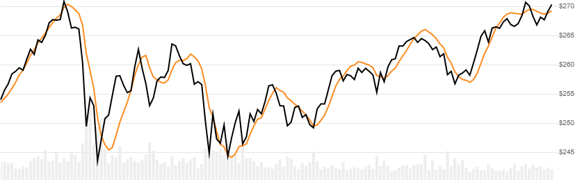

# Endpoint Moving Average (EPMA)

Endpoint Moving Average (EPMA), also known as Least Squares Moving Average (LSMA), plots the projected last point of a linear regression lookback window.
[[Discuss] :speech_balloon:](https://github.com/DaveSkender/Stock.Indicators/discussions/371 "Community discussion about this indicator")



```csharp
// usage
IEnumerable<EpmaResult> results =
  history.GetEpma(lookbackPeriod);  
```

## Parameters

| name | type | notes
| -- |-- |--
| `lookbackPeriod` | int | Number of periods (`N`) in the moving average.  Must be greater than 0.

### Historical quotes requirements

You must have at least `N` periods of `history`.

`history` is an `IEnumerable<TQuote>` collection of historical price quotes.  It should have a consistent frequency (day, hour, minute, etc).  See [the Guide](../../docs/GUIDE.md) for more information.

## Response

```csharp
IEnumerable<EpmaResult>
```

The first `N-1` periods will have `null` values since there's not enough data to calculate.  We always return the same number of elements as there are in the historical quotes.

### EpmaResult

| name | type | notes
| -- |-- |--
| `Date` | DateTime | Date
| `Epma` | decimal | Endpoint moving average

## Example

```csharp
// fetch historical quotes from your feed (your method)
IEnumerable<Quote> history = GetHistoryFromFeed("MSFT");

// calculate 20-period EPMA
IEnumerable<EpmaResult> results = history.GetEpma(20);

// use results as needed
EpmaResult result = results.LastOrDefault();
Console.WriteLine("EPMA on {0} was ${1}", result.Date, result.Epma);
```

```bash
EPMA on 12/31/2018 was $251.86
```
