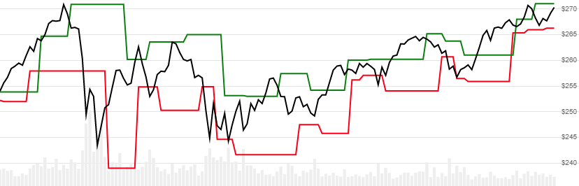

# Fractal Chaos Bands (FCB)

Created by Edward William Dreiss, Fractal Chaos Bands outline high and low price channels to depict broad less-chaotic price movements.  FCB is a channelized depiction of [Williams Fractal](../Fractal/README.md#content).
[[Discuss] :speech_balloon:](https://github.com/DaveSkender/Stock.Indicators/discussions/347 "Community discussion about this indicator")



```csharp
// usage
IEnumerable<FcbResult> results =
  history.GetFcb(lookbackPeriod);  
```

## Parameters

| name | type | notes
| -- |-- |--
| `windowSpan` | int | Fractal evaluation window span width (`S`).  Must be at least 2.  Default is 2.

The total evaluation window size is `2×S+1`, representing `±S` from the evalution date.  See [Williams Fractal](../Fractal/README.md#content) for more information about Fractals and `windowSpan`.

### Historical quotes requirements

You must have at least `2×S+1` periods of `history`; however, more is typically provided since this is a chartable candlestick pattern.

`history` is an `IEnumerable<TQuote>` collection of historical price quotes.  It should have a consistent frequency (day, hour, minute, etc).  See [the Guide](../../docs/GUIDE.md) for more information.

## Response

```csharp
IEnumerable<FcbResult>
```

The periods before the first fractal are `null` since they cannot be calculated.
We always return the same number of elements as there are in the historical quotes.

### FcbResult

| name | type | notes
| -- |-- |--
| `Date` | DateTime | Date
| `UpperBand` | decimal | FCB upper band
| `LowerBand` | decimal | FCB lower band

## Example

```csharp
// fetch historical quotes from your feed (your method)
IEnumerable<Quote> history = GetHistoryFromFeed("SPY");

// calculate Fcb(14)
IEnumerable<FcbResult> results = history.GetFcb(14);

// use results as needed
FcbResult result = results.LastOrDefault();
Console.WriteLine("FCB Upper Band on {0} was ${1}",
  result.Date, result.UpperBand);
```

```bash
FCB Upper Band on 12/31/2018 was $273.7
```
