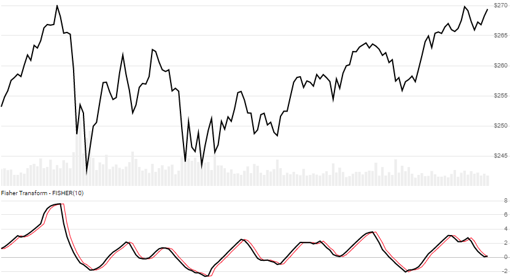

# Ehlers Fisher Transform

Created by John Ehlers, the [Fisher Transform](https://www.investopedia.com/terms/f/fisher-transform.asp) converts prices into a Gaussian normal distribution.
[[Discuss] :speech_balloon:](https://github.com/DaveSkender/Stock.Indicators/discussions/409 "Community discussion about this indicator")



```csharp
// usage
IEnumerable<FisherTransformResult> results =
  quotes.GetFisherTransform(lookbackPeriods);  
```

## Parameters

| name | type | notes
| -- |-- |--
| `lookbackPeriods` | int | Number of periods (`N`) in the lookback window.  Must be greater than 0.  Default is 10.

### Historical quotes requirements

You must have at least `N` periods of `quotes`.

`quotes` is an `IEnumerable<TQuote>` collection of historical price quotes.  It should have a consistent frequency (day, hour, minute, etc).  See [the Guide](../../docs/GUIDE.md) for more information.

## Response

```csharp
IEnumerable<FisherTransformResult>
```

We always return the same number of elements as there are in the historical quotes.

:warning: **Warning**: The first `N+15` warmup periods will have unusable decreasing magnitude, convergence-related precision errors that can be as high as ~25% deviation in earlier indicator values.

### FisherTransformResult

| name | type | notes
| -- |-- |--
| `Date` | DateTime | Date
| `Fisher` | decimal | Fisher Transform
| `Trigger` | decimal | FT offset by one period

### Utilities

- [.Find()](../../docs/UTILITIES.md#find-indicator-result-by-date)
- [.RemoveWarmupPeriods(qty)](../../docs/UTILITIES.md#remove-warmup-periods)

For pruning of warmup periods, we recommend using the following guidelines:

```csharp
quotes.GetFisherTransform(lookbackPeriods)
  .RemoveWarmupPeriods(lookbackPeriods+15);
```

See [Utilities and Helpers](../../docs/UTILITIES.md#content) for more information.

## Example

```csharp
// fetch historical quotes from your feed (your method)
IEnumerable<Quote> quotes = GetHistoryFromFeed("MSFT");

// calculate 10-period FisherTransform
IEnumerable<FisherTransformResult> results =
  quotes.GetFisherTransform(10);

// use results as needed
FisherTransformResult result = results.LastOrDefault();
Console.WriteLine("Fisher Transform on {0} was {1}",
                  result.Date, result.Fisher);
```

```bash
Fisher Transform on 12/31/2018 was -1.29
```
