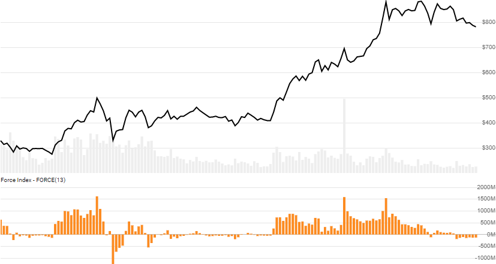

# Force Index

Created by Alexander Elder, the [Force Index](https://en.wikipedia.org/wiki/Force_index) depicts volume-based buying and selling pressure.
[[Discuss] :speech_balloon:](https://github.com/DaveSkender/Stock.Indicators/discussions/382 "Community discussion about this indicator")



```csharp
// usage
IEnumerable<ForceIndexResult> results =
  quotes.GetForceIndex(lookbackPeriods);  
```

## Parameters

| name | type | notes
| -- |-- |--
| `lookbackPeriods` | int | Lookback window (`N`) for the EMA of Force Index.  Must be greater than 0 and is commonly 2 or 13 (shorter/longer view).

### Historical quotes requirements

You must have at least `N+100` for `2×N` periods of `quotes`, whichever is more.  Since this uses a smoothing technique for EMA, we recommend you use at least `N+250` data points prior to the intended usage date for better precision.

`quotes` is an `IEnumerable<TQuote>` collection of historical price quotes.  It should have a consistent frequency (day, hour, minute, etc).  See [the Guide](../../docs/GUIDE.md) for more information.

## Response

```csharp
IEnumerable<ForceIndexResult>
```

The first `N` periods for will be `null` since they cannot be calculated.
We always return the same number of elements as there are in the historical quotes.

:warning: **Warning**: The first `N+100` periods will have decreasing magnitude, convergence-related precision errors that can be as high as ~5% deviation in indicator values for earlier periods.

### ForceIndexResult

| name | type | notes
| -- |-- |--
| `Date` | DateTime | Date
| `ForceIndex` | decimal | Force Index

### Utilities

- [.Find(lookupDate)](../../docs/UTILITIES.md#find-indicator-result-by-date)
- [.RemoveWarmupPeriods()](../../docs/UTILITIES.md#remove-warmup-periods)
- [.RemoveWarmupPeriods(qty)](../../docs/UTILITIES.md#remove-warmup-periods)

See [Utilities and Helpers](../../docs/UTILITIES.md#content) for more information.

## Example

```csharp
// fetch historical quotes from your feed (your method)
IEnumerable<Quote> quotes = GetHistoryFromFeed("SPY");

// calculate ForceIndex(13)
IEnumerable<ForceIndexResult> results = quotes.GetForceIndex(13);

// use results as needed
ForceIndexResult result = results.LastOrDefault();
Console.WriteLine("Force Index on {0} was {1}M",
  result.Date, result.ForceIndex/1000000);
```

```bash
Force Index on 12/31/2018 was -16.8M
```
