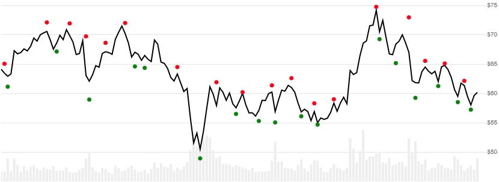

# Williams Fractal

Created by Larry Williams, [Fractal](https://www.investopedia.com/terms/f/fractal.asp) is a retrospective price pattern that identifies a central high or low point in a lookback window.
[[Discuss] :speech_balloon:](https://github.com/DaveSkender/Stock.Indicators/discussions/255 "Community discussion about this indicator")



```csharp
// usage
IEnumerable<FractalResult> results =
  history.GetFractal(windowSpan);  
```

## Parameters

| name | type | notes
| -- |-- |--
| `windowSpan` | int | Evaluation window span width (`S`).  Must be at least 2.  Default is 2.

The total evaluation window size is `2×S+1`, representing `±S` from the evalution date.

### Historical quotes requirements

You must have at least `2×S+1` periods of `history`; however, more is typically provided since this is a chartable candlestick pattern.

`history` is an `IEnumerable<TQuote>` collection of historical price quotes.  It should have a consistent frequency (day, hour, minute, etc).  See [the Guide](../../docs/GUIDE.md) for more information.

## Response

```csharp
IEnumerable<FractalResult>
```

The first and last `S` periods in `history` are unable to be calculated since there's not enough prior/following data.
We always return the same number of elements as there are in the historical quotes.

:warning: **Warning**: this price pattern looks forward and backward in the historical quotes so it will never identify a `fractal` in the last `S` periods of `history`.

### FractalResult

| name | type | notes
| -- |-- |--
| `Date` | DateTime | Date
| `FractalBear` | decimal | Value indicates a **high** point; otherwise `null` is returned.
| `FractalBull` | decimal | Value indicates a **low** point; otherwise `null` is returned.

## Example

```csharp
// fetch historical quotes from your feed (your method)
IEnumerable<Quote> history = GetHistoryFromFeed("SPY");

// calculate Fractal(5)
IEnumerable<FractalResult> results = history.GetFractal(5);

// use results as needed
FractalResult r = results.Where(x=>x.FractalBear!=null).LastOrDefault();
Console.WriteLine("FractalBear on {0} was ${1}", r.Date, r.FractalBear);
```

```bash
FractalBear on 12/12/2018 was $262.47
```
