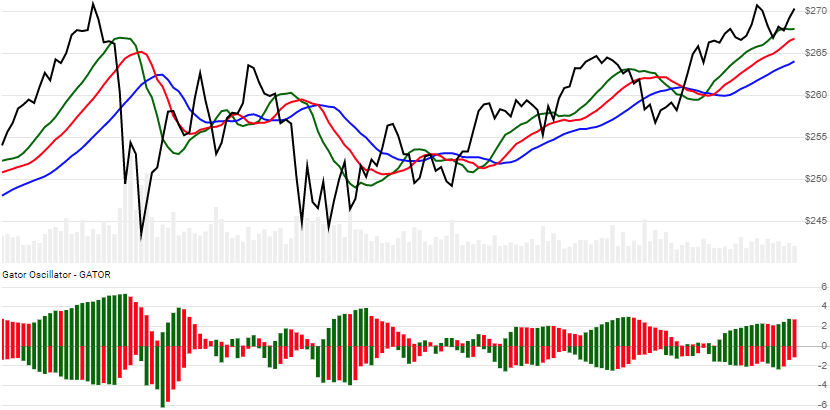

# Gator Oscillator

Created by Bill Williams, the Gator Oscillator is an expanded view of [Williams Alligator](../Alligator/README.md#content).
[[Discuss] :speech_balloon:](https://github.com/DaveSkender/Stock.Indicators/discussions/385 "Community discussion about this indicator")



```csharp
// usage
IEnumerable<GatorResult> results = Indicator.GetGator(history);
```

## Parameters

| name | type | notes
| -- |-- |--
| `history` | IEnumerable\<[TQuote](../../docs/GUIDE.md#historical-quotes)\> | Historical price quotes should have a consistent frequency (day, hour, minute, etc).

### Minimum history requirements

You must supply at least 115 periods of `history`. Since this uses a smoothing technique, we recommend you use at least 265 data points prior to the intended usage date for better precision.

## Response

```csharp
IEnumerable<GatorResult>
```

The first 10-20 periods will have `null` values since there's not enough data to calculate.  We always return the same number of elements as there are in the historical quotes.

:warning: **Warning**: The first 150 periods will have decreasing magnitude, convergence-related precision errors that can be as high as ~5% deviation in indicator values for earlier periods.

### GatorResult

| name | type | notes
| -- |-- |--
| `Date` | DateTime | Date
| `Upper` | decimal | Absolute value of Alligator `Jaw-Teeth`
| `Lower` | decimal | Absolute value of Alligator `Lips-Teeth`
| `UpperIsExpanding` | boolean | Upper value is growing
| `LowerIsExpanding` | boolean | Lower value is growing

## Example

```csharp
// fetch historical quotes from your favorite feed, in Quote format
IEnumerable<Quote> history = GetHistoryFromFeed("MSFT");

// calculate the Gator Oscillator
IEnumerable<GatorResult> results = Indicator.GetGator(history);

// use results as needed
GatorResult result = results.LastOrDefault();
Console.WriteLine("Upper on {0} was {1}", result.Date, result.Upper);
Console.WriteLine("Lower on {0} was {1}", result.Date, result.Lower);
```

```bash
Upper on 12/31/2018 was 7.45
Lower on 12/31/2018 was -9.24
```
